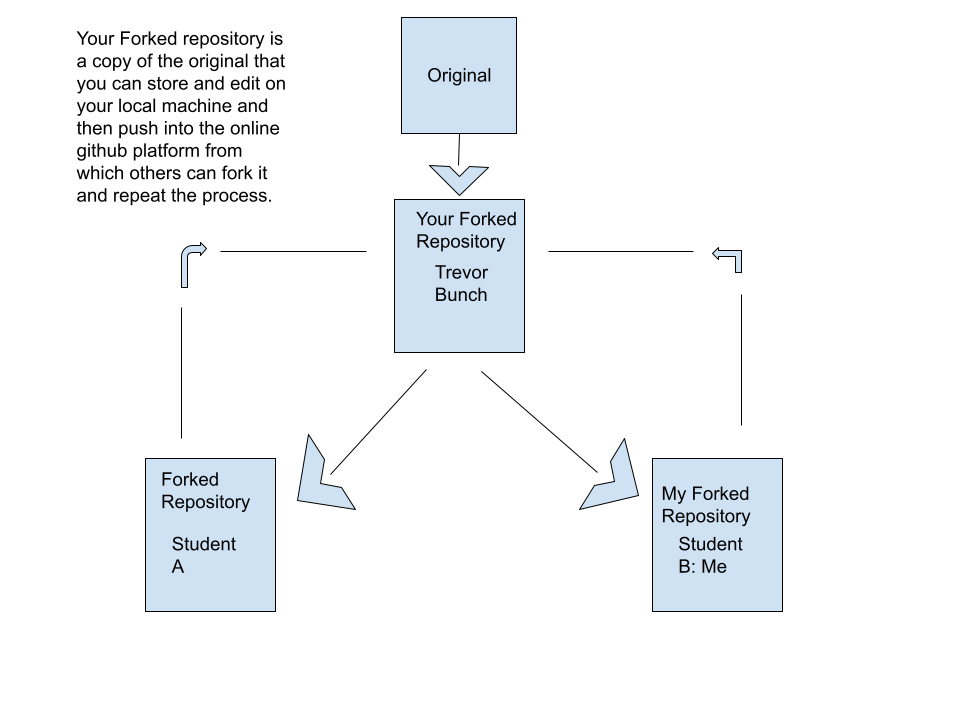

Course: CIS 411, Spring 2021
Instructor(s): Trevor Bunch
Name: Joe Vera
GitHub Handle: JoeV22
Repository: [My Forked Repository](https://github.com/JoeV22/cis411_lab1_CI)

https://github.com/trevordbunch/cis411_lab1_CI/tree/purelab
     
graph ql response
{
  "data": {
    "mutateAccount": {
      "id": "11bb0f91-9ccc-4f1a-9181-2041aa482959",
      "name": "Joe Vera",
      "email": "jv1233@messiah.edu"
    }
  }
}
On branch main
Your branch is ahead of 'origin/main' by 7 commits.
  (use "git push" to publish your local commits)

Untracked files:
  (use "git add <file>..." to include in what will be committed)
        assets/

nothing added to commit but untracked files present (use "git add" to track)
- What is the .circleci/config.yml doing?  
its a new file in the circleci directory, it is telling the circleci
to use the latest circleci pipline processing engine and pointing back to the exact directory.

It also specifies to use a package called orb.
in the pack orb
it declares a dependence on the welcome-orb.
Now it orchestrates or schedules set jobs.

- What do the various sections on the config file do?  
   specify the engine.
   specify the package.
   dictate what the package does.
   set the exact language used by the package.
   then it states to run its own 
   container jobs.

- When a CI build is successful, what does that philosophically and practically/precisely indicate about the build?  
   It's a straightforward build that
   is successful at scheduling or orchestrating the workflow. 
   

- If you were to take the next step and ready this project for Continuous Delivery, what additional changes might you make in this configuration (conceptual, not code)?  
        
   