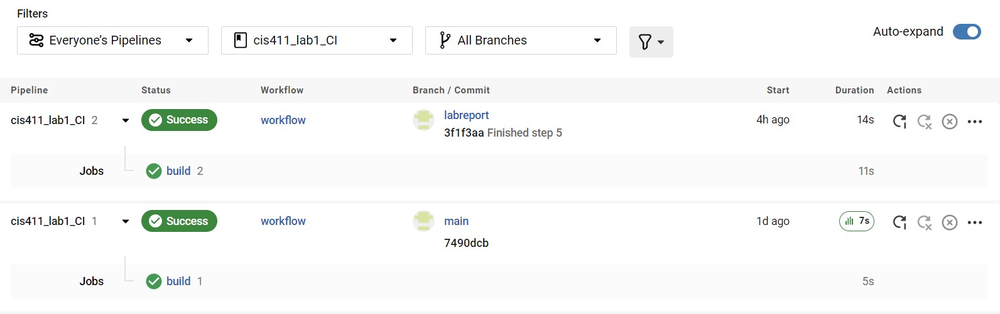
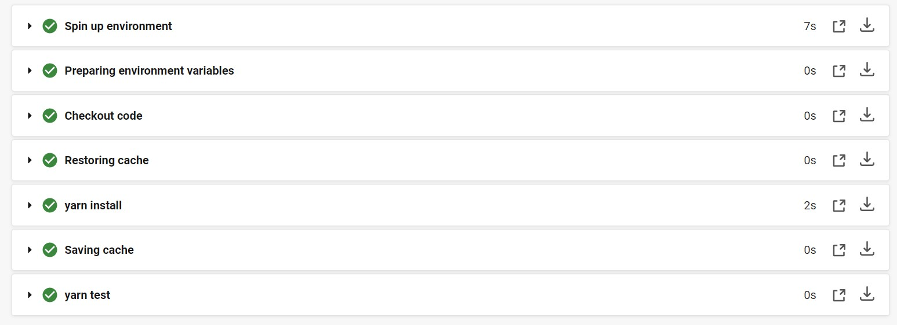

# Lab Report: Continuous Integration
___
**Course:** CIS 411, Spring 2022 
**Instructor(s):** [Trevor Bunch](https://github.com/trevordbunch)  
**Name:** Jamie Padovano
**GitHub Handle:** JPadovano1483 
**Repository:** https://github.com/JPadovano1483/cis411_lab1_CI
___

# Step 1: Fork this repository
- The URL of my forked repository: https://github.com/JPadovano1483/cis411_lab1_CI
  
  This diagram shows the relationship between Trevor Bunch's repo and my newly forked repo.
  

# Step 2: Clone your forked repository from the command line  
- Local file directory: C:\Users\padov\Github\cis411_lab1_CI
- The command to navigate to the directory when I open up the command line is: cd /c/Users/padov/Github/cis411_lab1_CI/

# Step 3: Run the application locally
- My GraphQL response from adding myself as an account on the test project
``` json
{
  "data": {
    "mutateAccount": {
      "id": "7817e2d6-3f12-44ab-bd80-adee46021e3d",
      "name": "Jamie Padovano",
      "email": "jp1483@messiah.edu"
    }
  }
}
```

# Step 4: Creating a feature branch
- The output of my git commit log
```
11a24d1 (HEAD -> labreport) added diagrams
3f1f3aa (origin/labreport) Finished step 5
676fa43 Finished steps 1-4
d5dff97 adding file to branch @trevordbunch
7490dcb (upstream/main, origin/main, origin/HEAD, main) Add Links to Node in Instructions
ecaaa53 Update branch terminology
c552213 Merge pull request #3 from hallienicholas/main
78ede9f Corrected error
1fe415c Merge pull request #1 from trevordbunch/labreport
13e571f Update Lab readme, instructions and templates
eafe253 Adjust submitting instructions
47e83cd Add images to LabReport
ec18770 Add Images
dbf826a Answer Step 4
a9c1de6 Complete Step 1, 2 and 3 of LAB_TREVORDBUNCH
1ead543 remove LAB.md
8c38613 Initial commit of labreport with @tangollama
dabceca Merge pull request #24 from tangollama/circleci
a4096db Create README.md
2f01bf4 Update LAB_INSTRUCTIONS.md
347bd50 Update LAB_INSTRUCTIONS.md
7aaa9f3 Update LAB_INSTRUCTIONS.md
```
This digram shows the relationship between my main and feature branch.
  

# Step 5: Setup a Continuous Integration configuration
- What is the .circleci/config.yml doing?  
  
  The .circleci/config.yml file orchestrates the entire delivery process from the initial build to deployment. It tells CircleCI what to do with the code and what to check and automates the process of testing the code/software that is being continuously integrated. This is where the specific tests are specified to run on the software.

- What do the various sections on the config file do?  
   1. Version: indicates what version of the CircleCI platform you are using
   2. Jobs: seems to essentially contain a list of named children which each contain a list of steps for CircleCI to run through
   3. Build: a child of jobs containing steps to run through
   4. Docker: associates a docker container to a job, Build in this case
   5. Working-directory: this tells CircleCI where to work
   6. Steps: gives a list of run directives to be executed, this is where the automated testing occurs
   7. Restore-cache: downloads and caches dependencies
   8. Run: specific directive to be executed, the first one installing yarn and the second using it to test the code
   9. Save-cache: this seems to save the cache of dependencies

- When a CI build is successful, what does that philosophically and practically/precisely indicate about the build?  
  
   This indicates that the build does not contain parts tht interfere with one another in any harmful ways. This means the repo is ready to continue with CI/CD development.

- If you were to take the next step and ready this project for Continuous Delivery, what additional changes might you make in this configuration (conceptual, not code)?  
  
   I might try to add some more tests to the config.yml file to make sure everything is working properly. This might entail adding more jobs and more steps/run commands within each job.

# Step 6: Merging the feature branch
* The output of my git commit log
```
31291f7 (HEAD -> main, origin/labreport, labreport) Final Commit
11a24d1 added diagrams
3f1f3aa Finished step 5
676fa43 Finished steps 1-4
d5dff97 adding file to branch @trevordbunch
7490dcb (upstream/main, origin/main, origin/HEAD) Add Links to Node in Instructions
ecaaa53 Update branch terminology
c552213 Merge pull request #3 from hallienicholas/main
78ede9f Corrected error
1fe415c Merge pull request #1 from trevordbunch/labreport
13e571f Update Lab readme, instructions and templates
eafe253 Adjust submitting instructions
47e83cd Add images to LabReport
ec18770 Add Images
dbf826a Answer Step 4
a9c1de6 Complete Step 1, 2 and 3 of LAB_TREVORDBUNCH
1ead543 remove LAB.md
8c38613 Initial commit of labreport with @tangollama
dabceca Merge pull request #24 from tangollama/circleci
a4096db Create README.md
2f01bf4 Update LAB_INSTRUCTIONS.md
347bd50 Update LAB_INSTRUCTIONS.md
```

* A screenshot of the _Jobs_ list in CircleCI

