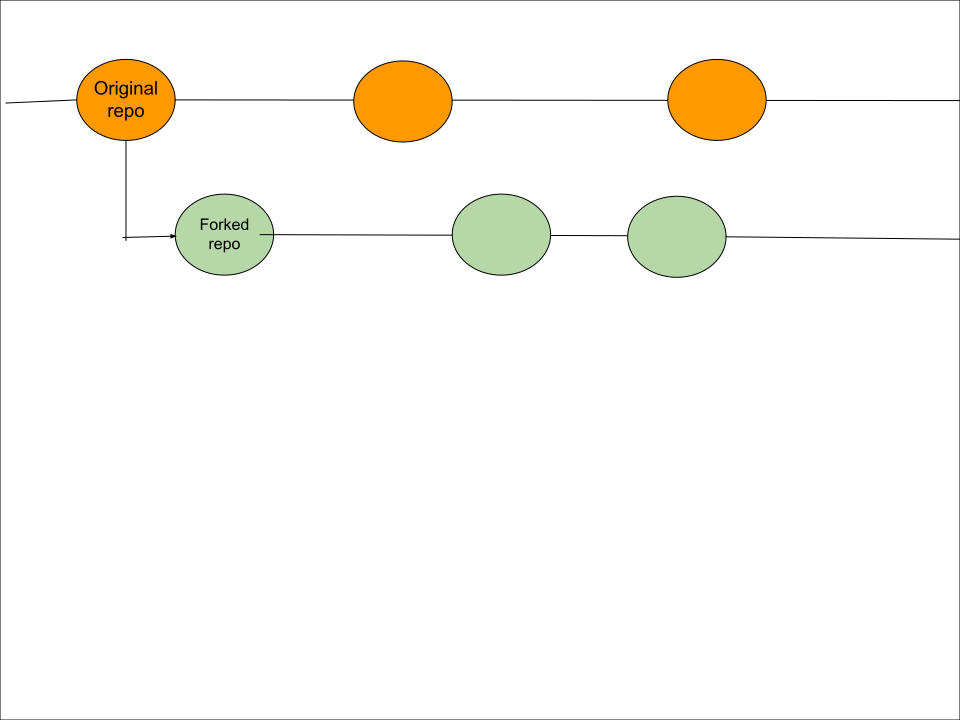
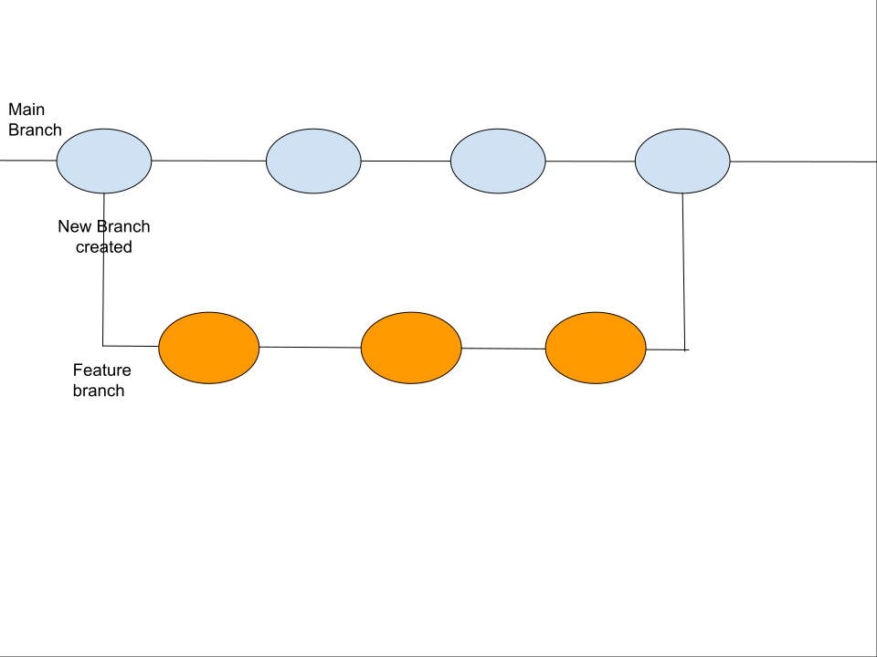

# Lab Report: Continuous Integration
___
**Course:** CIS 411, Spring 2021  
**Instructor(s):** [Trevor Bunch](https://github.com/trevordbunch)  
**Name:** Ammanuel Tamrat  
**GitHub Handle:** AmmanuelT  
**Repository:** https://github.com/AmmanuelT/cis411_lab1_CI.git 
___

# Step 1: Fork this repository
- The URL of my forked repository: https://github.com/AmmanuelT/cis411_lab1_CI.git
</br >

* A diagram of the forked repository



# Step 2: Clone your forked repository from the command line  
- My local file directory is where the code I will be making changes to before I commit and push to my online directory
- The command to navigate to the directory when I open up the command line is ```cd desktop/Spring/cis411/lab/cis411_lab1_CI```

# Step 3: Run the application locally
- My GraphQL response from adding myself as an account on the test project
``` json
{
  "data": {
    "mutateAccount": {
      "id": "fe680a5e-8802-4a65-8a13-7d932280c4ab",
      "name": "Ammanuel Tamrat",
      "email": "at1345@messiah.edu"
    }
  }
}
```

# Step 4: Creating a feature branch
- The output of my git commit log

```
2c8c842 (HEAD -> labreport, origin/labreport) added GraphQL response
7da11cc first commit for lab1 @trevorbunch
7490dcb (origin/main, origin/HEAD, main) Add Links to Node in Instructions
ecaaa53 Update branch terminology
c552213 Merge pull request #3 from hallienicholas/main
78ede9f Corrected error
1fe415c Merge pull request #1 from trevordbunch/labreport
13e571f Update Lab readme, instructions and templates
eafe253 Adjust submitting instructions
47e83cd Add images to LabReport
ec18770 Add Images
dbf826a Answer Step 4
a9c1de6 Complete Step 1, 2 and 3 of LAB_TREVORDBUNCH
1ead543 remove LAB.md
8c38613 Initial commit of labreport with @tangollama
dabceca Merge pull request #24 from tangollama/circleci
a4096db Create README.md
2f01bf4 Update LAB_INSTRUCTIONS.md
347bd50 Update LAB_INSTRUCTIONS.md
7aaa9f3 Update LAB_INSTRUCTIONS.md
37393ae Bug fixed
1949d2a Update LAB_INSTRUCTIONS.md
d36ad90 Update LAB.md
59ef18a Update LAB_INSTRUCTIONS.md
37be3c8 Update LAB_INSTRUCTIONS.md
97da547 Update LAB.md
0bd6244 updated Step 0 title
4562cd8 added npm and node install repreq
255051e adding template
13a09b7 Adding the LAB.md and correcting some instructions.
d2ddea5 Version 0.0.1 of the lab isntructions
ab312fc more progress
62fb0a5 more progress
fe1937b more in the lab instructions
3e807fb first section
9ae6b83 remove LAB.md
e429c1a lab instructions
ce1fcea circleci default config
80bbdbb circleci default config
968099e remove test db
7362cd1 working
44ce6ae Initial commit
```

* A diagram of the branch


# Step 5: Setup a Continuous Integration configuration
- **What is the .circleci/config.yml doing?**

  - .circleci/config.yml is the configuration file for circleCI  

- **What do the various sections on the config file do?**  

  - First the version tells us what version of circleCI we are running
  - Under jobs we define the different jobs that we want circleCI to be able to run:
  - We want the build job to run the code in the docker image circleci/node:10.3.
  - Once in the docker we want the name of the folder in the docker to be repo.
  - Next we have the steps that we want to go through when we run build:
    - checkout clones the project from github
    - restore_cache restores the cached files if the cache key provided already exists
    - if there is no key we will run yarn install and install all the dependencies
    - next run save_cache which will generate the installed dependencies to the key (if it does not already exist) so that we do not have to reinstall all the dependencies everytime we run a job
    - finally we run the tests  


- **When a CI build is successful, what does that philosophically and practically/precisely indicate about the build?**  
  - When a CI build is successful it means that all the dependancies have been installed properly and cached and that the yarn test has passed which means that the commit will not make the code fail tests  

- **If you were to take the next step and ready this project for Continuous Delivery, what additional changes might you make in this configuration (conceptual, not code)?**  
  - We would add a job that would prepare the code for deployment, test the code and deploy the code.

# Step 6: Merging the feature branch
* The output of my git commit log
```
Trevors-MBP:cis411_lab0 trevorbunch$ git log --oneline
dbf826a (HEAD -> labreport, origin/labreport) Answer Step 4
a9c1de6 Complete Step 1, 2 and 3 of LAB_TREVORDBUNCH
1ead543 remove LAB.md
8c38613 Initial commit of labreport with @tangollama
dabceca (upstream/main, origin/main, origin/HEAD, main) Merge pull request #24 from tangollama/circleci
a4096db Create README.md
...
44ce6ae Initial commit
(END)
```

* A screenshot of the _Jobs_ list in CircleCI


# Step 7: Submitting a Pull Request
_Remember to reference at least one other student in the PR content via their GitHub handle._


# Step 8: [EXTRA CREDIT] Augment the core project
PR reference in the report to one of the following:
1. Add one or more unit tests to the core assignment project. 
2. Configure the CircleCI config.yml to automatically build a Docker image of the project.
3. Configure an automatic deployment of the successful CircleCI build to an Amazon EC2 instance.
