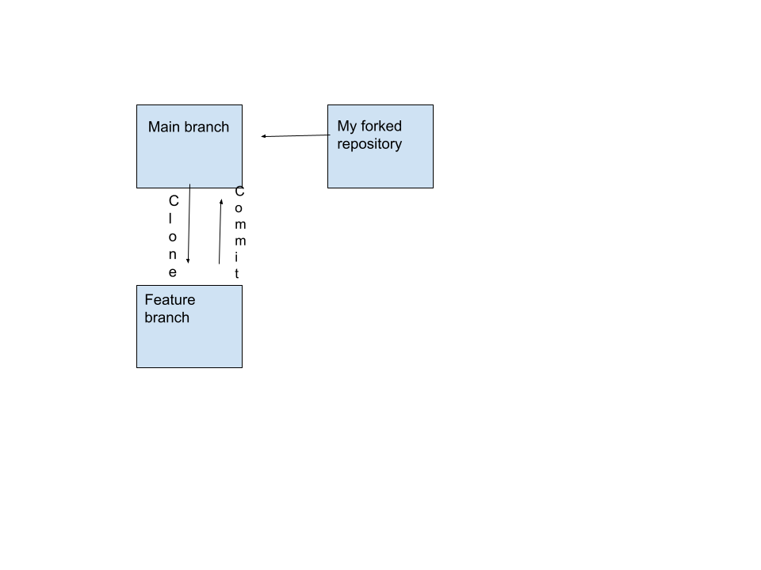
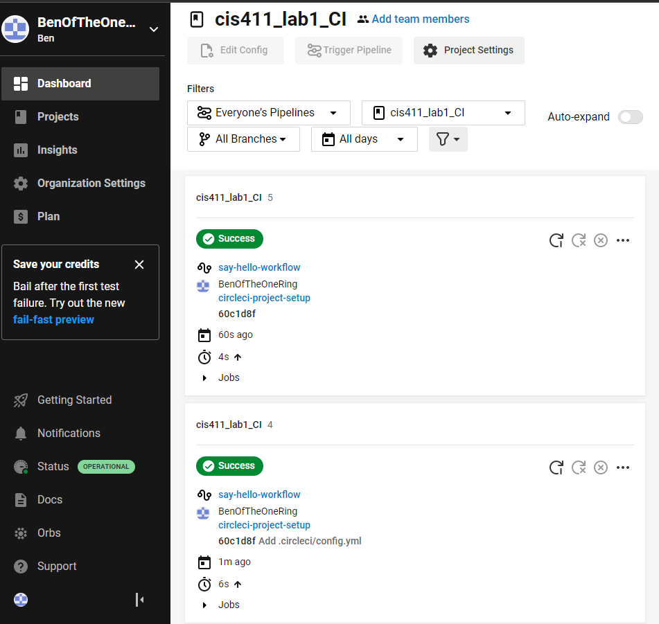

# Lab Report: Continuous Integration
___
**Course:** CIS 411, Spring 2021  
**Instructor(s):** [Trevor Bunch](https://github.com/trevordbunch)  
**Name:** Ben Clarke  
**GitHub Handle:** BenOfTheOneRing  
**Repository:** [Your Forked Repository](https://github.com/BenOfTheOneRing/cis411_lab1_CI)  
___

# Step 1: Fork this repository
- The URL of my forked repository: https://github.com/BenOfTheOneRing/cis411_lab1_CI
- The accompanying diagram of what my fork precisely and conceptually represents 


# Step 2: Clone your forked repository from the command line  
- My local file directory is ~/git 411/cis411_lab1_CI
- The command to navigate to the directory when I open up the command line is cd /git 411/cis411_lab1_CI

# Step 3: Run the application locally
- My GraphQL response from adding myself as an account on the test project
``` json
{
  "data": {
    "mutateAccount": {
      "id": "092e0a38-0803-491b-a9e3-34ae3137675a",
      "name": "YOUR FULL NAME",
      "email": "YOUR EMAIL"
    }
  }
}
```

# Step 4: Creating a feature branch
- The output of my git commit log
```

0db2493 (HEAD -> labreport, origin/labreport) my commit
00d5833 your commit and reference @trevordbunch in the message
94babae (origin/purelab, origin/HEAD, purelab) Merge pull request #59 from JeffSinsel/purelab
2e92bd8 Fixed typos and links in markdown files
fa4fc85 Update Instructions
f8513e0 Update Node links to Instructions
d4f22eb Update repo branch names
0e3ae4c Reset purelab
050b420 Merge pull request #2 from trevordbunch/main
1fe415c Merge pull request #1 from trevordbunch/labreport
13e571f Update Lab readme, instructions and templates
eafe253 Adjust submitting instructions
47e83cd Add images to LabReport
ec18770 Add Images
dbf826a Answer Step 4
a9c1de6 Complete Step 1, 2 and 3 of LAB_TREVORDBUNCH
1ead543 remove LAB.md
8c38613 Initial commit of labreport with @tangollama
dabceca Merge pull request #24 from tangollama/circleci
a4096db Create README.md
2f01bf4 Update LAB_INSTRUCTIONS.md
347bd50 Update LAB_INSTRUCTIONS.md
```
- The accompanying diagram of what my feature branch precisely and conceptually represents...

# Step 5: Setup a Continuous Integration configuration
- What is the .circleci/config.yml doing?  
  - The config file is telling circleci what version it is running and the different environments and jobs circleci is supposed to complete


- What do the various sections on the config file do?  
  * Jobs is a set of steps that are to be executed. 
  * Version says which version of circleci to use
  * Workflows are a set of rules defining a collection of jobs and their run order
   

- When a CI build is successful, what does that philosophically and practically/precisely indicate about the build?  
  * That it is ready to be added to the original directory and implemented into the system  

- If you were to take the next step and ready this project for Continuous Delivery, what additional changes might you make in this configuration (conceptual, not code)?  
   * I would automate this process so a person does not need to spend time on this

# Step 6: Merging the feature branch
* The output of my git commit log
```
058219b (HEAD -> purelab, origin/labreport, labreport) Commit number 2 @trevordbunch
0534e15 just commited
0db2493 my commit
00d5833 your commit and reference @trevordbunch in the message
94babae (origin/purelab, origin/HEAD) Merge pull request #59 from JeffSinsel/purelab
2e92bd8 Fixed typos and links in markdown files
fa4fc85 Update Instructions
f8513e0 Update Node links to Instructions
d4f22eb Update repo branch names
0e3ae4c Reset purelab
050b420 Merge pull request #2 from trevordbunch/main
1fe415c Merge pull request #1 from trevordbunch/labreport
13e571f Update Lab readme, instructions and templates
eafe253 Adjust submitting instructions
47e83cd Add images to LabReport
ec18770 Add Images

...
44ce6ae Initial commit
(END)
```

* A screenshot of the _Jobs_ list in CircleCI


# Step 7: Submitting a Pull Request
_Remember to reference at least one other student in the PR content via their GitHub handle._


# Step 8: [EXTRA CREDIT] Augment the core project
PR reference in the report to one of the following:
1. Add one or more unit tests to the core assignment project. 
2. Configure the CircleCI config.yml to automatically build a Docker image of the project.
3. Configure an automatic deployment of the successful CircleCI build to an Amazon EC2 instance.
