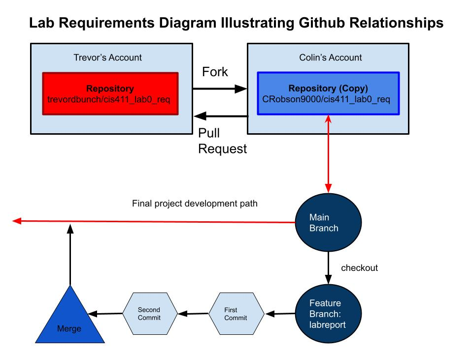
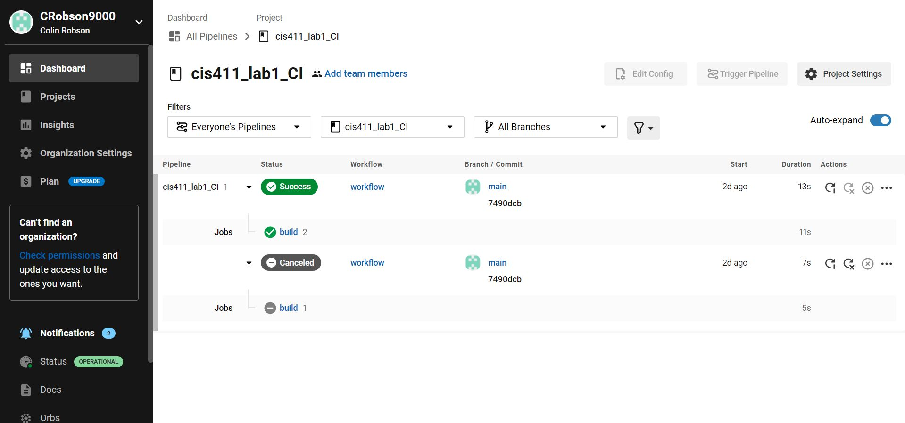

# Lab Report: Continuous Integration
___
**Course:** CIS 411, Spring 2021  
**Instructor(s):** [Trevor Bunch](https://github.com/trevordbunch)  
**Name:** Colin Robson  
**GitHub Handle:** @CRobson9000  
**Repository:** [Lab Repo](https://github.com/CRobson9000/cis411_lab1_CI/tree/purelab)  
___

## Github Relationships Diagram ##


# Step 1: Fork this repository
- The URL of my forked repository: [click here](https://github.com/CRobson9000/cis411_lab1_CI/tree/purelab)

# Step 2: Clone your forked repository from the command line  
- My local file directory is: C:\Users\cjrtw\Documents\College\Junior Year\Spring\Systems Analysis and Design Concepts\circleCILab\cis411_lab1_CI

# Step 3: Run the application locally
- GraphQL response to adding myself as an account on the test project:

``` json
{
  "data": {
    "mutateAccount": {
      "id": "6d43b37b-82a5-4f46-a3d8-48e85eee1101",
      "name": "COLIN ROBSON",
      "email": "cjrtwin0901@gmail.com"
    }
  }
}
```
# Step 4: Creating a feature branch
- Git log after first commit:
```json
f223c9a (HEAD -> labreport, origin/labreport) first commit @trevordbunch
7490dcb (origin/main, origin/HEAD, main) Add Links to Node in Instructions
ecaaa53 Update branch terminology
c552213 Merge pull request #3 from hallienicholas/main
78ede9f Corrected error
1fe415c Merge pull request #1 from trevordbunch/labreport
13e571f Update Lab readme, instructions and templates
eafe253 Adjust submitting instructions
47e83cd Add images to LabReport

```

# Step 5: Setup a Continuous Integration configuration
- What is the .circleci/config.yml doing?  
  &nbsp;&nbsp;&nbsp;The circleci/config.yml file orchestrates the delievry of the software from build to deployment by analyzing and testing your code so that it can be ready to be delivered to users.  It acts as sort of the gate keeper between development and delivery because it makes sure everything is set up right and is working properly.  

- What do the various sections on the config file do?  
   * The version command specifies which version of Circle CI it should run and it also allows it to see if there are any deprecated commands.
   * The build line specifies the name of the job
   * The jobs command allows the programmer to program what jobs it wants circle ci to complete in order for it to pass. In the example code, it creates an image for the software docker which specifies what environment you want to run this code in, then it specifies the steps you want to take in this environment.  In this case, the program will checkout the code with github, restore the cache with the specified dependencies, run "yarn install" on the command line, save the cache, the run yarn test on teh command line.   
   * Note:  You can add a workflows section of the code, which allows you to create, name, and execute workflows, which are just groups of jobs.  You can specify triggers and say what jobs you want to run together by using a workflow.  

- When a CI build is successful, what does that philosophically and practically/precisely indicate about the build?  
  * When the CI build is successful, it means that it completed all of the jobs without error.  If the jobs are programmed correctly and precisely, this means that the code has passed all of the tests it needs to in order for it to be delivered to the masses or merged with the main branch of code.  Using the analogy from before, it means that the gatekeeper has agreed to let it pass because it completed all of its tasks/jobs.  

- If you were to take the next step and ready this project for Continuous Delivery, what additional changes might you make in this configuration (conceptual, not code)?  
   
  * You could have Circle CI communicate and utilize your project management software to automatically "complete stories" for you.  This would furthur streamline the development process because now all you have to do is run a workflow and it will test your code, set things straight on the Github sides of things through merging or committing, and also set things straight on the project management side of things by automatically completing whatever story the code was for.  It can also send messages to other people working on the project to alert them that something is complete.  All of these crucial steps resulted from the push of a button, which saves time and, again, makes sure the whole development and delivery process is streamlined.   
# Step 6: Merging the feature branch
* The output of my git commit log
```
7301e45 (HEAD -> labreport) some grammitcal errors fixed and some content changed
29c3b10 (main) actual final commit
0d23043 final commit
f223c9a (origin/labreport) first commit @trevordbunch
7490dcb (origin/main, origin/HEAD) Add Links to Node in Instructions
ecaaa53 Update branch terminology
c552213 Merge pull request #3 from hallienicholas/main
78ede9f Corrected error
1fe415c Merge pull request #1 from trevordbunch/labreport
13e571f Update Lab readme, instructions and templates
eafe253 Adjust submitting instructions

```

* A screenshot of the _Jobs_ list in CircleCI  
  


# Step 7: Submitting a Pull Request
Referenced Tyler Regitz (@ztigerR) in my pull request

