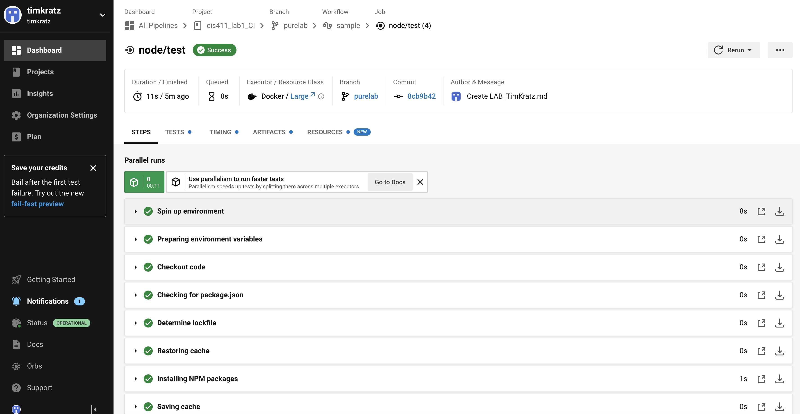

# Lab Report: Continuous Integration
___
**Course:** CIS 411, Spring 2021  
**Instructor(s):** [Trevor Bunch](https://github.com/trevordbunch)  
**Name:** Austin Dorsey  
**GitHub Handle:** Dorsecles  
**Repository:** Dorsecles
/
cis411_lab1_CI
  
___

# Step 1: Fork this repository
- The URL of my forked repository:(https://github.com/Dorsecles/cis411_lab1_CI)
- The accompanying diagram of what my fork precisely and conceptually represents...
- 

# Step 2: Clone your forked repository from the command line  
- My local file directory is C:\Users\adors\OneDrive\Documents\CircleCi\cis411_lab1_CI
- The command to navigate to the directory when I open up the command line is cd cis411_lab1_CI

# Step 3: Run the application locally
- My GraphQL response from adding myself as an account on the test project
``` json
{
  "data": {
    "mutateAccount": {
      "id": "5c345bb5-0c54-44ae-8e57-f5f00b0eddbb",
      "name": "TREVOR BUNCH",
      "email": "tbunch@messiah.edu"
    }
  }
}
```
``` json
{
  "data": {
    "mutateAccount": {
      "id": "d429c436-93a5-49f3-9a91-af3d13975cda",
      "name": "Austin Dorsey",
      "email": "ad1412@messiah.edu",
    }
  }
}
``` 

# Step 4: Creating a feature branch
- The output of my git commit log
```
[labreport d7b4585] Added feature branch @trevordbunch
 2 files changed, 612 insertions(+), 1 deletion(-)
 create mode 100644 labreports/LAB_Dorsecles.md
```
- The accompanying diagram of what my feature branch precisely and conceptually represents...

# Step 5: Setup a Continuous Integration configuration
- What is the .circleci/config.yml doing?  
It automates certain tasks so that it saves time and allows code to be released rapidly.

- What do the various sections on the config file do?  
   First it checks the version you want. Then it downlads what you need and checks for dependecies and falls back if there are problems. Then it installs an application. Finally it runs tests.

- When a CI build is successful, what does that philosophically and practically/precisely indicate about the build?  
   The build works as intended.

- If you were to take the next step and ready this project for Continuous Delivery, what additional changes might you make in this configuration (conceptual, not code)?  
   I would allow it to deploy my code.

# Step 6: Merging the feature branch
* The output of my git commit log
```
0dbee66 (HEAD -> labreport) Added another diagram @trevordbunch
3b94526 Answered questions in lab report and added a diagram @trevordbunch
d7b4585 (origin/labreport) Added feature branch @trevordbunch
7490dcb (origin/main, origin/HEAD, main) Add Links to Node in Instructions
ecaaa53 Update branch terminology
c552213 Merge pull request #3 from hallienicholas/main
78ede9f Corrected error
1fe415c Merge pull request #1 from trevordbunch/labreport
13e571f Update Lab readme, instructions and templates
eafe253 Adjust submitting instructions
47e83cd Add images to LabReport
ec18770 Add Images
dbf826a Answer Step 4
a9c1de6 Complete Step 1, 2 and 3 of LAB_TREVORDBUNCH
1ead543 remove LAB.md
8c38613 Initial commit of labreport with @tangollama
dabceca Merge pull request #24 from tangollama/circleci
a4096db Create README.md
2f01bf4 Update LAB_INSTRUCTIONS.md
347bd50 Update LAB_INSTRUCTIONS.md
7aaa9f3 Update LAB_INSTRUCTIONS.md
37393ae Bug fixed
1949d2a Update LAB_INSTRUCTIONS.md
d36ad90 Update LAB.md
59ef18a Update LAB_INSTRUCTIONS.md
37be3c8 Update LAB_INSTRUCTIONS.md
97da547 Update LAB.md
0bd6244 updated Step 0 title
4562cd8 added npm and node install repreq
255051e adding template
13a09b7 Adding the LAB.md and correcting some instructions.
d2ddea5 Version 0.0.1 of the lab isntructions
ab312fc more progress
62fb0a5 more progress
fe1937b more in the lab instructions
3e807fb first section
9ae6b83 remove LAB.md
e429c1a lab instructions
ce1fcea circleci default config
80bbdbb circleci default config
968099e remove test db
7362cd1 working
44ce6ae Initial commit
~
(END)
```

* A screenshot of the _Jobs_ list in CircleCI


# Step 7: Submitting a Pull Request
_Remember to reference at least one other student in the PR content via their GitHub handle._


# Step 8: [EXTRA CREDIT] Augment the core project
PR reference in the report to one of the following:
1. Add one or more unit tests to the core assignment project. 
2. Configure the CircleCI config.yml to automatically build a Docker image of the project.
3. Configure an automatic deployment of the successful CircleCI build to an Amazon EC2 instance.
