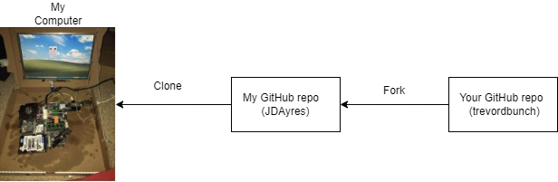
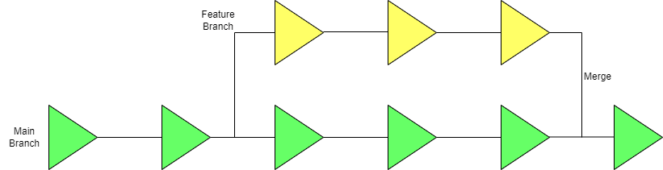
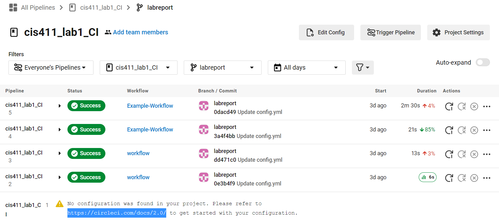
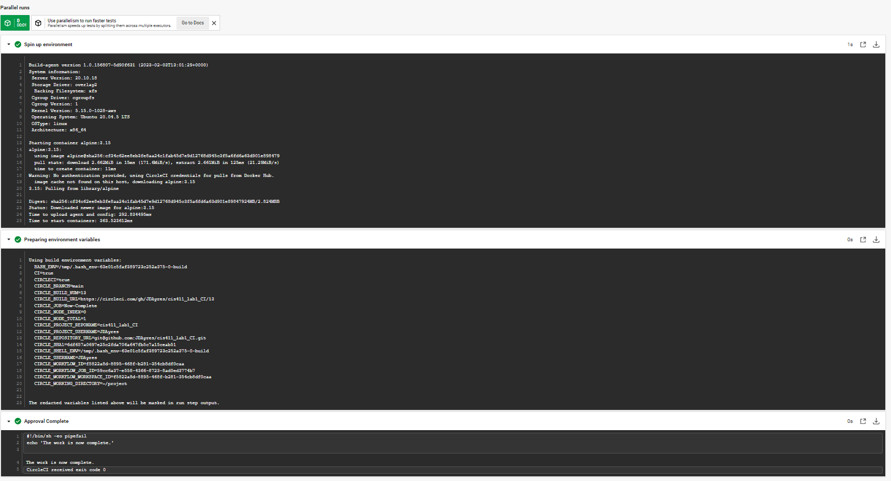

# Lab Report: Continuous Integration
___
**Course:** CIS 411, Spring 2021  
**Instructor(s):** [Trevor Bunch](https://github.com/trevordbunch)  
**Name:** Justin Ayres  
**GitHub Handle:** JDAyres  
**Repository:** https://github.com/JDAyres/cis411_lab1_CI   
___

# Step 1: Fork this repository
- The URL of my forked repository:
   https://github.com/JDAyres/cis411_lab1_CI
- The accompanying diagram of what my fork precisely and conceptually represents...
 

# Step 2: Clone your forked repository from the command line  
- My local file directory is
  - C:\Users\justi\Documents\GitHub\cis411_lab1_CI
- The command to navigate to the directory when I open up the command line is
  - cd Documents/GitHub/Cis411_lab1_CI 

# Step 3: Run the application locally
- My GraphQL response from adding myself as an account on the test project
``` json
{
  "data": {
    "mutateAccount": {
      "id": "65cdee98-a5ae-4a40-9cc2-28cb61d570df",
      "name": "Justin Ayres",
      "email": "ja1340@messiah.edu"
    }
  }
}
```

# Step 4: Creating a feature branch
- The output of my git commit log
```
da1b1ee Create CreatingFeatureBranchLogs.txt
b266844 Hey @trevordbunch check out this sick commit
94babae (upstream/purelab, upstream/HEAD, origin/purelab, origin/HEAD, purelab) Merge pull request #59 from JeffSinsel/purelab
2e92bd8 Fixed typos and links in markdown files
fa4fc85 Update Instructions
f8513e0 Update Node links to Instructions
7490dcb (upstream/main) Add Links to Node in Instructions
ecaaa53 Update branch terminology
d4f22eb Update repo branch names
c552213 Merge pull request #3 from hallienicholas/main
78ede9f Corrected error
0e3ae4c Reset purelab
050b420 Merge pull request #2 from trevordbunch/main
1fe415c Merge pull request #1 from trevordbunch/labreport
13e571f Update Lab readme, instructions and templates
eafe253 Adjust submitting instructions
47e83cd Add images to LabReport
ec18770 Add Images
dbf826a Answer Step 4
a9c1de6 Complete Step 1, 2 and 3 of LAB_TREVORDBUNCH
1ead543 remove LAB.md
8c38613 Initial commit of labreport with @tangollama
dabceca Merge pull request #24 from tangollama/circleci
a4096db Create README.md
2f01bf4 Update LAB_INSTRUCTIONS.md
347bd50 Update LAB_INSTRUCTIONS.md
7aaa9f3 Update LAB_INSTRUCTIONS.md
37393ae Bug fixed
1949d2a Update LAB_INSTRUCTIONS.md
d36ad90 Update LAB.md
59ef18a Update LAB_INSTRUCTIONS.md
37be3c8 Update LAB_INSTRUCTIONS.md
97da547 Update LAB.md
0bd6244 updated Step 0 title
4562cd8 added npm and node install repreq
255051e adding template
13a09b7 Adding the LAB.md and correcting some instructions.
d2ddea5 Version 0.0.1 of the lab isntructions
ab312fc more progress
62fb0a5 more progress
fe1937b more in the lab instructions
3e807fb first section
9ae6b83 remove LAB.md
e429c1a lab instructions
ce1fcea circleci default config
80bbdbb circleci default config
968099e remove test db
7362cd1 working
44ce6ae Initial commit
```
- The accompanying diagram of what my feature branch precisely and conceptually represents


# Step 5: Setup a Continuous Integration configuration
- What is the .circleci/config.yml doing?  
  - This is a program that runs a script that will print "Hello World!" and require a hold for approval to complete the task
  - It will first run to the Dock and run the "Hello World!" step
  - This is followed by fetching the code from the repo so that it can see it and run it
  - Then the code will run the node container followed by the code it collected from the repo
  - then th code will create a workflow which will await me to click and hold for approval to complete the task


- What do the various sections on the config file do?  
  - "version" will indicate the version of the CircleCI platform
  - The "jobs" section will contain a collection of what are known as children, these children will have names and are the... well... jobs that the code will complete
    - Hello-World is and example of one of the children in jobs
  - The "steps" is a collection of "run" directives
  - The "run" directives are executed commands
  - The "checkout" section will fetch code from my repo
  - The "name" sections name what is is you are doing in for that command
  - the "command" section is where you will enter in the command you wish to run at that stage
  - "requires" creates a section of code that must be completed or run, this is why the "Hold-for-Approval" must be completed before the test can be complete


- When a CI build is successful, what does that philosophically and practically/precisely indicate about the build?  
   
   When a CI build is successful, practically, it means that the code will run properly in the desired environment and will operate without error and should integrate with the system. Philosophically, this indicates that the programmer or team of programmers methods to integrate the code work.

- If you were to take the next step and ready this project for Continuous Delivery, what additional changes might you make in this configuration (conceptual, not code)?  
  - I would include a more effective and organized method of documentation for the, this would help determine the exact changes for each section of the code. I would also implement multiple test environments, outdated environments to be specific, this way people who may be running on an outdated environments can be included in testing.
   

# Step 6: Merging the feature branch
* The output of my git commit log
```
0dacd49 (origin/labreport, labreport) Update config.yml
3a4f4bb Update config.yml
dd471c0 Update config.yml
0e3b4f9 Update config.yml
50c5827 Create config.yml
da1b1ee Create CreatingFeatureBranchLogs.txt
b266844 Hey @trevordbunch check out this sick commit
94babae (upstream/purelab, upstream/HEAD, origin/purelab, origin/HEAD, purelab) Merge pull request #59 from JeffSinsel/purelab
2e92bd8 Fixed typos and links in markdown files
fa4fc85 Update Instructions
f8513e0 Update Node links to Instructions
7490dcb (upstream/main) Add Links to Node in Instructions
ecaaa53 Update branch terminology
d4f22eb Update repo branch names
c552213 Merge pull request #3 from hallienicholas/main
78ede9f Corrected error
0e3ae4c Reset purelab
050b420 Merge pull request #2 from trevordbunch/main
1fe415c Merge pull request #1 from trevordbunch/labreport
13e571f Update Lab readme, instructions and templates
eafe253 Adjust submitting instructions
47e83cd Add images to LabReport
ec18770 Add Images
dbf826a Answer Step 4
a9c1de6 Complete Step 1, 2 and 3 of LAB_TREVORDBUNCH
1ead543 remove LAB.md
8c38613 Initial commit of labreport with @tangollama
dabceca Merge pull request #24 from tangollama/circleci
a4096db Create README.md
2f01bf4 Update LAB_INSTRUCTIONS.md
347bd50 Update LAB_INSTRUCTIONS.md
7aaa9f3 Update LAB_INSTRUCTIONS.md
37393ae Bug fixed
1949d2a Update LAB_INSTRUCTIONS.md
d36ad90 Update LAB.md
59ef18a Update LAB_INSTRUCTIONS.md
37be3c8 Update LAB_INSTRUCTIONS.md
97da547 Update LAB.md
0bd6244 updated Step 0 title
4562cd8 added npm and node install repreq
255051e adding template
13a09b7 Adding the LAB.md and correcting some instructions.
d2ddea5 Version 0.0.1 of the lab isntructions
ab312fc more progress
62fb0a5 more progress
fe1937b more in the lab instructions
3e807fb first section
9ae6b83 remove LAB.md
e429c1a lab instructions
ce1fcea circleci default config
80bbdbb circleci default config
968099e remove test db
7362cd1 working
44ce6ae Initial commit
```

* A screenshot of the _Jobs_ list in CircleCI




# Step 7: Submitting a Pull Request
_Remember to reference at least one other student in the PR content via their GitHub handle._


# Step 8: [EXTRA CREDIT] Augment the core project
PR reference in the report to one of the following:
1. Add one or more unit tests to the core assignment project. 
- I believe that I did complete this, albeit accidentally, for some reason teh default code in my config.yml file was not there when I set it up so I located this link and used this code.
  - https://circleci.com/docs/config-intro/
  - With this code I believe that I had added more than one unit test
1. Configure the CircleCI config.yml to automatically build a Docker image of the project.
2. Configure an automatic deployment of the successful CircleCI build to an Amazon EC2 instance.
