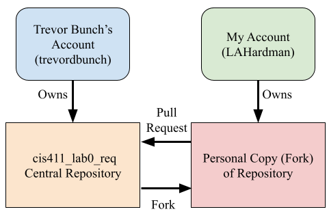
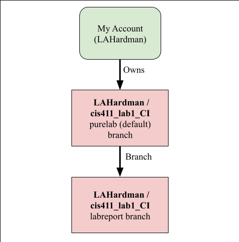

# Lab Report: Continuous Integration
___
**Course:** CIS 411, Spring 2021  
**Instructor(s):** [Trevor Bunch](https://github.com/trevordbunch)  
**Name:** Luke Hardman  
**GitHub Handle:** LAHardman  
**Repository:** https://github.com/LAHardman/cis411_lab1_CI  
___

# Step 1: Fork this repository
- The URL of my forked repository: https://github.com/LAHardman/cis411_lab1_CI
- The accompanying diagram of what my fork precisely and conceptually represents...



# Step 2: Clone your forked repository from the command line  
- My local file directory is...
`C:\Users\lhard\Documents\GitHub\cis411_lab1_CI`
- The command to navigate to the directory when I open up the command line is...  
`cd C:\Users\lhard\OneDrive\Documents\GitHub\cis411_lab1_CI`

# Step 3: Run the application locally
- My GraphQL response from adding myself as an account on the test project
``` json
{
  "data": {
    "mutateAccount": {
      "id": "d95af70a-79d5-4578-ac48-c2939d849d33",
      "name": "Luke Hardman",
      "email": "lh1392@messiah.edu"
    }
  }
}
```

# Step 4: Creating a feature branch
- The output of my git commit log
```
GitHub\cis411_lab1_CI>git log --oneline
44a5796 (HEAD -> labreport, origin/labreport) Finished step 1, with diagram added
12ff5eb created lab report based on template from @trevorbunch
94babae (origin/purelab, origin/HEAD, purelab) Merge pull request #59 from JeffSinsel/purelab
2e92bd8 Fixed typos and links in markdown files
fa4fc85 Update Instructions
f8513e0 Update Node links to Instructions
d4f22eb Update repo branch names
0e3ae4c Reset purelab
050b420 Merge pull request #2 from trevordbunch/main
1fe415c Merge pull request #1 from trevordbunch/labreport
13e571f Update Lab readme, instructions and templates
eafe253 Adjust submitting instructions
47e83cd Add images to LabReport
ec18770 Add Images
dbf826a Answer Step 4
...
44ce6ae Initial commit
(END)
```
- The accompanying diagram of what my feature branch precisely and conceptually represents...



# Step 5: Setup a Continuous Integration configuration
- What is the .circleci/config.yml doing?  


- What do the various sections on the config file do?  
   

- When a CI build is successful, what does that philosophically and practically/precisely indicate about the build?  
   

- If you were to take the next step and ready this project for Continuous Delivery, what additional changes might you make in this configuration (conceptual, not code)?  
   

# Step 6: Merging the feature branch
* The output of my git commit log
```

```

* A screenshot of the _Jobs_ list in CircleCI


# Step 7: Submitting a Pull Request
_Remember to reference at least one other student in the PR content via their GitHub handle._


# Step 8: [EXTRA CREDIT] Augment the core project
PR reference in the report to one of the following:
1. Add one or more unit tests to the core assignment project. 
2. Configure the CircleCI config.yml to automatically build a Docker image of the project.
3. Configure an automatic deployment of the successful CircleCI build to an Amazon EC2 instance.
