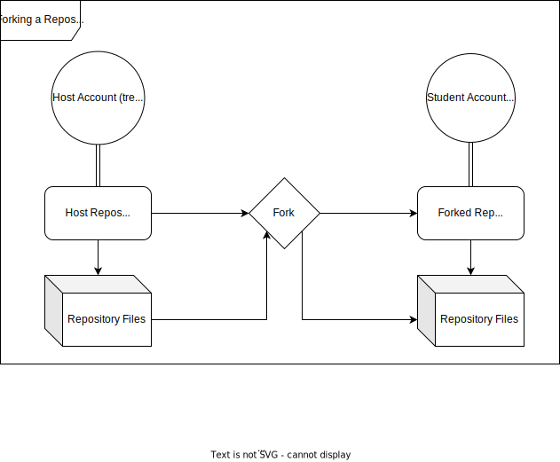
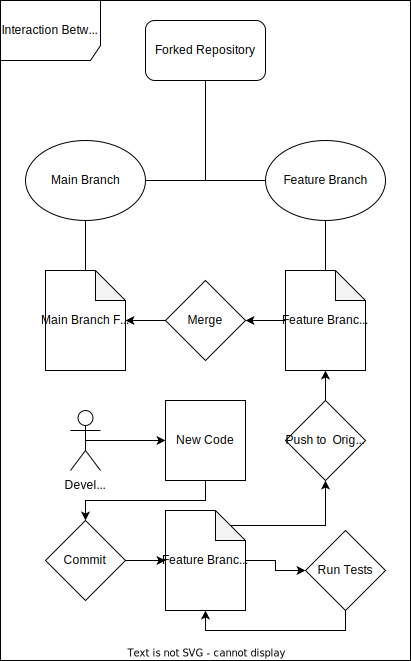

# Lab Report: Continuous Integration
___
**Course:** CIS 411, Spring 2021  
**Instructor(s):** [Trevor Bunch](https://github.com/trevordbunch)  
**Name:** Noah Brenneis  
**Repository:** NoahBrenneis/cis411_lab_CI  
____

# Step 1: Fork this repository
- The URL of my forked repository: https://github.com/NoahBrenneis/cis411_lab1_CI
- The accompanying diagram of what my fork precisely and conceptually represents...



# Step 2: Clone your forked repository from the command line  
- My local file directory is C:/Users/noahb/cis411_lab1_CI
- The command to navigate to the directory when I open up the command line is `cd cis411_lab1_CI`

# Step 3: Run the application locally
- My GraphQL response from adding myself as an account on the test project
``` json
{
  "data": {
    "mutateAccount": {
      "id": "a98621d0-878e-41e3-b5c6-8ee7205ca590",
      "name": "Noah Brenneis",
      "email": "nb1317@messiah.edu"
    }
  }
}
```

# Step 4: Creating a feature branch
- The output of my git commit log
```
$ git log --oneline
15b12f7 (HEAD -> labreports, origin/labreports) Added personal info and the URL to the repository
5cf7b2e Copied the lab template provided by @trevordbunch
94babae (origin/purelab, origin/HEAD, purelab) Merge pull request #59 from JeffSinsel/purelab
2e92bd8 Fixed typos and links in markdown files
fa4fc85 Update Instructions
f8513e0 Update Node links to Instructions
d4f22eb Update repo branch names
0e3ae4c Reset purelab
...
44ce6ae Initial commit
(END)
```
- The accompanying diagram of what my feature branch precisely and conceptually represents...



# Step 5: Setup a Continuous Integration configuration
- What is the .circleci/config.yml doing?  

The config.yml file in the repository acts as a gateway for CircleCI to access the repository and run tests on its code. These tests, called Jobs, are defined by the project manager and act as a way to make sure newly introduced code is both compatible with the previous code and works as intended. Whenever a new commit is made to any branches with a config file inside, CircleCI automatically runs it and documents the results under the project workflow.

If the config file is able to successfully run and all of its Jobs are able to be completed, the workflow is considered a success. If a problem occurs, such as a failed job, the workflow fails and the commit is cancelled. From there, a user can go to the workflow's details and see what went wrong and where, alowing them to debug their code.

Another action performed by the config file is the selection of orbs to use with the repository's code. Orbs are essentially configuration libraries, and can be given to any config file to apply their configurations to it. By setting certain orbs into a project, a user can ensure the project conforms to whatever default tests the orb includes.

- What do the various sections on the config file do?  
   
The config.yml file is divided into three sections: version, orbs, and workflows. The version section simply defines what version of CircleCI to use with the program, with the current version being 2.1. The orbs section is where the orbs to be used with the repository are defined. These orbs are categorized by code base, and if multiple code bases exist within a repository, orbs from any of those code bases can be included.

The workflows section is the bulk of the config file, as it indicates what jobs are to be done with the repository. Multiple workflows can be defined at once, which can be used to categorize jobs based on what they do. This makes it easier to debug code, since the user can ignore workflows that succeeded and only focus on the ones that failed.

The jobs themselves are defined by their name, which comes from their related tags. Within a job, the necessary information to be supplied to CircleCI is given, such as version number and package manager for the default "node/test" job.

- When a CI build is successful, what does that philosophically and practically/precisely indicate about the build?  
   
If CircleCI is successfully able to run and build the config file, it means all of the jobs within the configuration file were successful and the web server for the relevant language was able to run the repository's code. In other words, there are no issues with the code, as far as CircleCI is concerned.

In addition, a successful build indicates that the previous commit to the repository both works as intended and does not break any prior code. This means the commit is safe to be pushed to the origin, and will not interfere with anyone else's code.

- If you were to take the next step and ready this project for Continuous Delivery, what additional changes might you make in this configuration (conceptual, not code)?  
   
To prepare for Continuous Delivery, additional jobs would have to be added to the config file that periodically run every few days. These jobs ensure that no new data added to the project's database interferes with the project itself, as well as making sure minor updates do not interfere with the existing product. These jobs would also have to prevent destruction of code, by preventing any commits that delete important sections of code.

# Step 6: Merging the feature branch
* The output of my git commit log
```
$ git log --oneline
0b6ae84 (HEAD -> purelab, origin/purelab, origin/HEAD) Merge branch 'labreports' into purelab This merge is to add the lab report into the main branch
9a5f528 (origin/labreports, labreports) Added diagrams to the lab report and completed steps 1-5
5669621 Added Fork_Relationship.svg
06c0d25 Added Branch_Relationship.svg
b0c973b Update config.yml
717b8cf Create config.yml
58a8a8b Added an empty config.yml file for use with circleCI
15b12f7 Added personal info and the URL to the repository
5cf7b2e Copied the lab template provided by @trevordbunch
94babae (upstream/purelab) Merge pull request #59 from JeffSinsel/purelab
2e92bd8 Fixed typos and links in markdown files
...
44ce6ae Initial commit
(END)
```

* A screenshot of the _Jobs_ list in CircleCI


# Step 7: Submitting a Pull Request
_Remember to reference at least one other student in the PR content via their GitHub handle._


# Step 8: [EXTRA CREDIT] Augment the core project
PR reference in the report to one of the following:
1. Add one or more unit tests to the core assignment project. 
2. Configure the CircleCI config.yml to automatically build a Docker image of the project.
3. Configure an automatic deployment of the successful CircleCI build to an Amazon EC2 instance.
