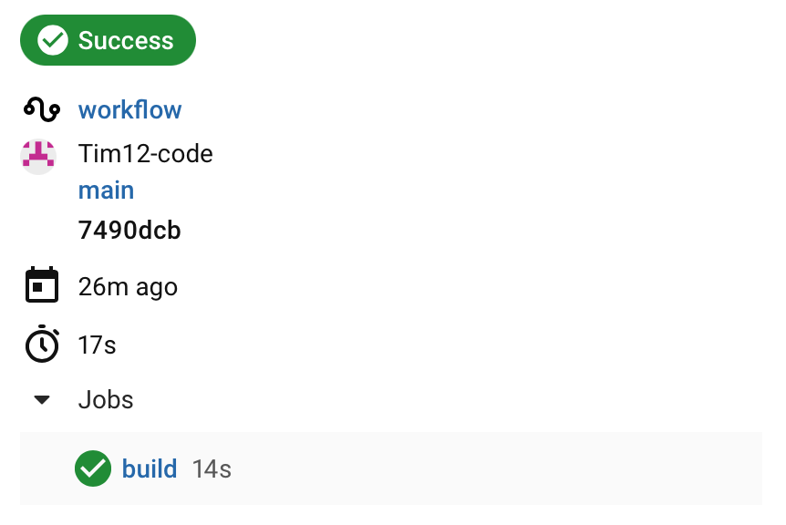

# Lab Report: Continuous Integration
___
**Course:** CIS 411, Spring 2021  
**Instructor(s):** [Trevor Bunch](https://github.com/trevordbunch)  
**Name:** Timothy Diana  
**GitHub Handle:** Tim12-code  
**Repository:** CIS411_LAB1_CI
___

# Step 1: Fork this repository
- The URL of my forked repository: https://github.com/Tim12-code/cis411_lab1_CI/tree/purelab
- 

# Step 2: Clone your forked repository from the command line  
- cloned

# Step 3: Run the application locally
{
  "data": {
    "mutateAccount": {
      "id": "f38bef95-f42e-4aaa-881c-264f5f433075",
      "name": "Timothy Diana",
      "email": "td1245@messiah.edu"
    }
  }
}

# Step 4: Creating a feature branch
```
baa28a5 (HEAD -> labreport, origin/labreport) commiting branch from @trevorbunch repository
f8513e0 (upstream/purelab, origin/purelab, purelab) Update Node links to Instructions
d4f22eb Update repo branch names
0e3ae4c Reset purelab
050b420 Merge pull request #2 from trevordbunch/main
1fe415c Merge pull request #1 from trevordbunch/labreport
13e571f Update Lab readme, instructions and templates
eafe253 Adjust submitting instructions
47e83cd Add images to LabReport
ec18770 Add Images
dbf826a Answer Step 4
a9c1de6 Complete Step 1, 2 and 3 of LAB_TREVORDBUNCH
1ead543 remove LAB.md
8c38613 Initial commit of labreport with @tangollama
```
- 

# Step 5: Setup a Continuous Integration configuration
- What is the .circleci/config.yml doing?  
  

  It setup an environment inside my branch were it could do various jobs to it. It prepared environment variables, checked out code, restored cache, installed yarn, saved cache, and tested yarn.

- What do the various sections on the config file do?  

  hey scanned through my project and installed yarn adn built fresh packages and saved to my lockfile. It restored and save my caches as well. It ran my yarn install to see if it was working.

- When a CI build is successful, what does that philosophically and practically/precisely indicate about the build?  
   
  It means that the build has no integration errors. The team is working together well and all code is integrated successfully. Through building and tests it sees if errors are present. It allows for a team to devlope together easier.

- If you were to take the next step and ready this project for Continuous Delivery, what additional changes might you make in this configuration (conceptual, not code)?

  I would allow the configuration of the build to run weekly to help integrate code together when we release updates. This will be a rapid way to test our system and not allow intigration errors to sustain.


# Step 6: Merging the feature branch
* The output of my git commit log
```
67d89a3 (HEAD -> main) commit on main
4c7ef1c Merge branch 'labreport' into main
3e665de (labreport) final commit
baa28a5 (origin/labreport) commiting branch from @trevorbunch repository
f8513e0 (upstream/purelab, origin/purelab, purelab) Update Node links to Instructions
7490dcb (upstream/main, origin/main, origin/HEAD) Add Links to Node in Instructions
ecaaa53 Update branch terminology
```

* A screenshot of the _Jobs_ list in CircleCI


# Step 7: Submitting a Pull Request
- pull request sent


# Step 8: [EXTRA CREDIT] Augment the core project
- N/A