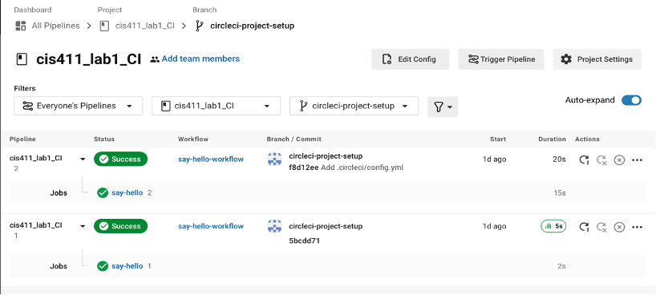

# Lab Report: Continuous Integration
___
**Course:** CIS 411, Spring 2021  
**Instructor(s):** [Trevor Bunch](https://github.com/trevordbunch)  
**Name:** Alanah Inniss
**GitHub Handle:** alanahinniss
**Repository:** https://github.com/alanahinniss/cis411_lab1_CI 
___

# Step 1: Fork this repository
- The URL of my forked repository: https://github.com/alanahinniss/cis411_lab1_CI
- The accompanying diagram of what my fork precisely and conceptually represents...

# Step 2: Clone your forked repository from the command line  
- My local file directory is...
"/Users/alanahinniss/Documents/GitHub/cis411_lab1_CI"

- The command to navigate to the directory when I open up the command line is...
cd /Users/alanahinniss/Documents/GitHub/cis411_lab1_CI

# Step 3: Run the application locally
- My GraphQL response from adding myself as an account on the test project
``` json
{
  "data": {
    "mutateAccount": {
      "id": "0011cce1-7991-433d-b5fa-6cf5fbee64ec",
      "name": "Alanah Inniss",
      "email": "ai1177@hotmail.com"
    }
  }
}
```

# Step 4: Creating a feature branch
- The output of my git commit log
```
b51f172 (HEAD -> main, origin/main, origin/HEAD) Create LAB_alanahinniss.md
dc0b8dd Update package-lock.json
7490dcb (upstream/main) Add Links to Node in Instructions
ecaaa53 Update branch terminology
c552213 Merge pull request #3 from hallienicholas/main
78ede9f Corrected error
1fe415c Merge pull request #1 from trevordbunch/labreport
13e571f Update Lab readme, instructions and templates
eafe253 Adjust submitting instructions
47e83cd Add images to LabReport
ec18770 Add Images
dbf826a Answer Step 4
a9c1de6 Complete Step 1, 2 and 3 of LAB_TREVORDBUNCH
1ead543 remove LAB.md
8c38613 Initial commit of labreport with @tangollama
dabceca Merge pull request #24 from tangollama/circleci
a4096db Create README.md
2f01bf4 Update LAB_INSTRUCTIONS.md
347bd50 Update LAB_INSTRUCTIONS.md
7aaa9f3 Update LAB_INSTRUCTIONS.md
37393ae Bug fixed
1949d2a Update LAB_INSTRUCTIONS.md
d36ad90 Update LAB.md

```
- The accompanying diagram of what my feature branch precisely and conceptually represents...

# Step 5: Setup a Continuous Integration configuration

- What is the .circleci/config.yml doing?  

There is a sequence cycle that the code is going through. Everything starts up and the code is then checked. The cahce is then restored and the dependencies for the project is still installed - it is then checked to make sure it is running properly. 

- What do the various sections on the config file do?  

Firstly, the config file tells you which version it is. It then shows the processes that will be carried out. The dependencies as well as the directory it is in can be viewed. Then if there are cache based on a key, it is restored. There is a run fuction, "yarn install" command which installs specific dependencies - which save the cache. The "yarn test" is runned and then returns results. 

- When a CI build is successful, what does that philosophically and practically/precisely indicate about the build?  

Pratically, it means that there isnt anything wrong with the build. Philosophically, it can be released or pushed - this shows that it is connected to the GitHub correctly. 

- If you were to take the next step and ready this project for Continuous Delivery, what additional changes might you make in this configuration (conceptual, not code)?  

1) Check to ensure that the code passes all the requirements in which it is test for. 
2) Ensure that the project is updates regularly. 
3) Ensure that the project is secure so that it cannot be tampered with by unauthorized individuasl. 
   

# Step 6: Merging the feature branch
* The output of my git commit log
```
a4513ea (HEAD -> main, origin/main, origin/HEAD) Merge branch 'labreport'
df2f81a Setup a Continuous Integration configuration
2199dad added first log with other edits
b51f172 Create LAB_alanahinniss.md
9b7836d (origin/labreport, labreport) Create LAB_alanahinniss.md
dc0b8dd Update package-lock.json
7490dcb (upstream/main) Add Links to Node in Instructions
ecaaa53 Update branch terminology
c552213 Merge pull request #3 from hallienicholas/main
78ede9f Corrected error
1fe415c Merge pull request #1 from trevordbunch/labreport
13e571f Update Lab readme, instructions and templates
eafe253 Adjust submitting instructions
47e83cd Add images to LabReport
ec18770 Add Images
dbf826a Answer Step 4
a9c1de6 Complete Step 1, 2 and 3 of LAB_TREVORDBUNCH
1ead543 remove LAB.md
8c38613 Initial commit of labreport with @tangollama
dabceca Merge pull request #24 from tangollama/circleci
a4096db Create README.md
2f01bf4 Update LAB_INSTRUCTIONS.md
347bd50 Update LAB_INSTRUCTIONS.md
(END)
```

* A screenshot of the _Jobs_ list in CircleCI


# Step 7: Submitting a Pull Request
_Remember to reference at least one other student in the PR content via their GitHub handle._


# Step 8: [EXTRA CREDIT] Augment the core project
PR reference in the report to one of the following:
1. Add one or more unit tests to the core assignment project. 
2. Configure the CircleCI config.yml to automatically build a Docker image of the project.
3. Configure an automatic deployment of the successful CircleCI build to an Amazon EC2 instance.
