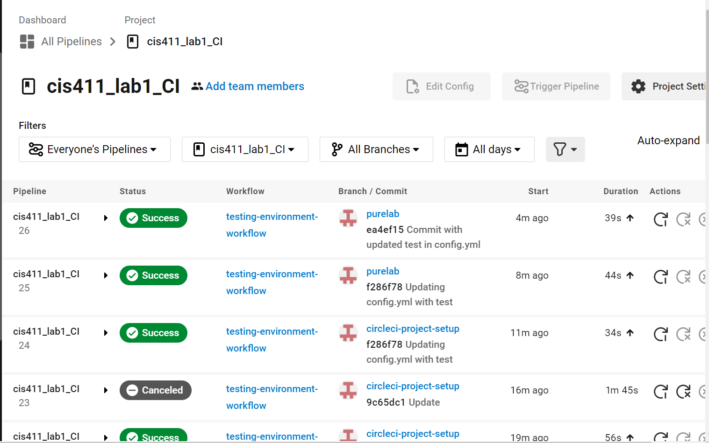
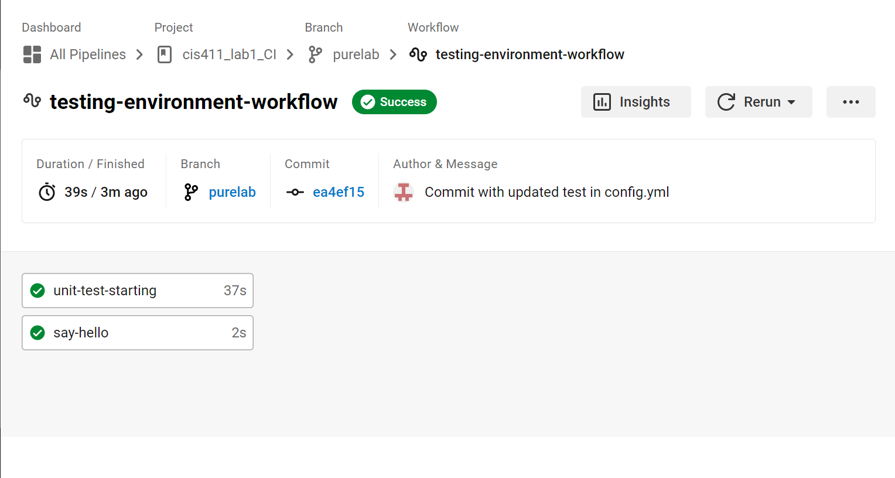

# Lab Report: Continuous Integration
___
**Course:** CIS 411, Spring 2023  
**Instructor(s):** [Trevor Bunch](https://github.com/trevordbunch)  
**Name:** Grace Taylor  
**GitHub Handle:** gracet712  
**Repository:** https://github.com/gracet712/cis411_lab1_CI 
___

# Step 1: Fork this repository
- The URL of my forked repository: https://github.com/gracet712/cis411_lab1_CI

- The accompanying diagram of what my fork precisely and conceptually represents:


# Step 2: Clone your forked repository from the command line  
- My local file directory is: C:/Users/evens/Documents/"Folder 1"/"Messiah University"/Schoolwork/"Semester 4"/"CIS 411"/"CIS 411 Labs"/cis411_lab1_CI
- The command to navigate to the directory when I open up the command line is: cd C:/Users/evens/Documents/"Folder 1"/"Messiah University"/Schoolwork/"Semester 4"/"CIS 411"/"CIS 411 Labs"/cis411_lab1_CI

# Step 3: Run the application locally
- My GraphQL response from adding myself as an account on the test project.
``` json
{
  "data": {
    "mutateAccount": {
      "id": "edae3acc-1a5e-4194-b6e1-df56011c8b2e",
      "name": "Grace Taylor",
      "email": "gt1185@messiah.edu"
    }
  }
}
```

# Step 4: Creating a feature branch
- The output of my git commit log
```
c3c3e82 (HEAD -> labreport, origin/labreport) Lab 1 first commit creating LAB_gracet712.md @trevordbunch
fa4fc85 (origin/purelab, origin/HEAD, purelab) Update Instructions
f8513e0 Update Node links to Instructions
d4f22eb Update repo branch names
0e3ae4c Reset purelab
050b420 Merge pull request #2 from trevordbunch/main
1fe415c Merge pull request #1 from trevordbunch/labreport
13e571f Update Lab readme, instructions and templates
eafe253 Adjust submitting instructions
47e83cd Add images to LabReport
ec18770 Add Images
dbf826a Answer Step 4
a9c1de6 Complete Step 1, 2 and 3 of LAB_TREVORDBUNCH
1ead543 remove LAB.md
8c38613 Initial commit of labreport with @tangollama
dabceca Merge pull request #24 from tangollama/circleci
a4096db Create README.md
2f01bf4 Update LAB_INSTRUCTIONS.md
347bd50 Update LAB_INSTRUCTIONS.md
7aaa9f3 Update LAB_INSTRUCTIONS.md
37393ae Bug fixed
1949d2a Update LAB_INSTRUCTIONS.md
d36ad90 Update LAB.md
59ef18a Update LAB_INSTRUCTIONS.md
37be3c8 Update LAB_INSTRUCTIONS.md
97da547 Update LAB.md
0bd6244 updated Step 0 title
4562cd8 added npm and node install repreq
255051e adding template
13a09b7 Adding the LAB.md and correcting some instructions.
d2ddea5 Version 0.0.1 of the lab isntructions
ab312fc more progress
62fb0a5 more progress
fe1937b more in the lab instructions
3e807fb first section
9ae6b83 remove LAB.md
e429c1a lab instructions
ce1fcea circleci default config
80bbdbb circleci default config
968099e remove test db
7362cd1 working
44ce6ae Initial commit
```

- The accompanying diagram of what my feature branch precisely and conceptually represents:


# Step 5: Setup a Continuous Integration configuration

Diagram illustrating the elements of the config file:


- What is the .circleci/config.yml doing?  

The .circleci directory contains the config.yml file. This file basically runs tests to check if new commits to the project have broken any functionality. The default config.yml file just echoes "Hello, World!". In a real project, it would be updated to contain steps that actually test whether the project remains functional.

- What do the various sections on the config file do? 

Jobs organize steps that will be performed. The jobs are then organized in a workflow. In each job, the execution environment is specified, and then a list of steps is given. Later, workflows are defined as a list of jobs. These workflows are performed when new commits are made and pushed to CircleCI, and it will test whether anything in the commit prevents a workflow from completing successfully.

For instance, in the default config.yml file, the job "say-hello" is defined with an execution environment and steps that include the command "echo Hello, World!". Then the workflows are listed, with the "say-hello-workflow" defined to include one job, "say-hello." This just tests whether this one workflow/job completes successfully.
   

- When a CI build is successful, what does that philosophically and practically/precisely indicate about the build?

Practically/precisely, this indicates that all of the steps/jobs/workflows in the config.yml file completed successfully. For instance, in the default config.yml file, it indicates that the workflow "say-hello-workflow" succeeded. Philosophically, this means nothing in the latest commit broke any of the project's functionality. This requires adding jobs to the workflows that actually test the project's functionality.
   

- If you were to take the next step and ready this project for Continuous Delivery, what additional changes might you make in this configuration (conceptual, not code)?  

I would add real tests to the config.yml file, so that it actually tests project functionality. This would prepare for Continuous Delivery by ensuring that new commits do not break the project. I would then add a workflow/job to automate the project's deployment. 
   

# Step 6: Merging the feature branch
* The output of my git commit log:

```
ea4ef15 (HEAD -> purelab) Commit with updated test in config.yml
f286f78 (origin/purelab, origin/circleci-project-setup, origin/HEAD, circleci-project-setup) Updating config.yml with test
9c65dc1 Update
9bb9706 Update
5604fed Update
cfaf9a9 Update
4d7e9af Update
65c7ce4 Update
2503a99 Update
28d0dc9 Update
838cea5 Update
8cd8021 Update
1bdae99 Update
c614fa2 Update
08cc31f Update
dfb6336 Update
a2d3425 Update
77a0792 testing possible unit test
0722d13 Update lab report
a5d64ad Adding diagram to section 5
81bd213 Update to lab report section 5
88df774 Updating lab report section 5
c94d213 Merge branch 'labreport' into circleci-project-setup
daaf8e7 Add .circleci/config.yml
467628f (origin/labreport, labreport) Update to lab report
29d55ee Adding diagram to lab report
b3c0023 Adding diagram to lab report
5d528ca Updating lab report
c3c3e82 Lab 1 first commit creating LAB_gracet712.md @trevordbunch
fa4fc85 Update Instructions
f8513e0 Update Node links to Instructions
d4f22eb Update repo branch names
0e3ae4c Reset purelab
050b420 Merge pull request #2 from trevordbunch/main
1fe415c Merge pull request #1 from trevordbunch/labreport
13e571f Update Lab readme, instructions and templates
eafe253 Adjust submitting instructions
47e83cd Add images to LabReport
ec18770 Add Images
dbf826a Answer Step 4
a9c1de6 Complete Step 1, 2 and 3 of LAB_TREVORDBUNCH
1ead543 remove LAB.md
8c38613 Initial commit of labreport with @tangollama
dabceca Merge pull request #24 from tangollama/circleci
a4096db Create README.md
2f01bf4 Update LAB_INSTRUCTIONS.md
347bd50 Update LAB_INSTRUCTIONS.md
7aaa9f3 Update LAB_INSTRUCTIONS.md
37393ae Bug fixed
1949d2a Update LAB_INSTRUCTIONS.md
d36ad90 Update LAB.md
59ef18a Update LAB_INSTRUCTIONS.md
37be3c8 Update LAB_INSTRUCTIONS.md
97da547 Update LAB.md
0bd6244 updated Step 0 title
4562cd8 added npm and node install repreq
255051e adding template
13a09b7 Adding the LAB.md and correcting some instructions.
d2ddea5 Version 0.0.1 of the lab isntructions
ab312fc more progress
62fb0a5 more progress
fe1937b more in the lab instructions
3e807fb first section
9ae6b83 remove LAB.md
e429c1a lab instructions
ce1fcea circleci default config
80bbdbb circleci default config
968099e remove test db
7362cd1 working
44ce6ae Initial commit
(END)

```

* A screenshot of the _Jobs_ list in CircleCI

The updated CirclCI interface offers a view of each pipeline and its workflows and also a view of the jobs within a given workflow. Screenshots of both are below.





# Step 7: Submitting a Pull Request

# Step 8: [EXTRA CREDIT] Augment the core project
PR reference in the report to one of the following:
1. Add one or more unit tests to the core assignment project. 

Link to commit with final attempted unit test:
https://github.com/gracet712/cis411_lab1_CI/commit/ea4ef152f4f7251851409b22e172c1073581e7bc

2. Configure the CircleCI config.yml to automatically build a Docker image of the project.
3. Configure an automatic deployment of the successful CircleCI build to an Amazon EC2 instance.
