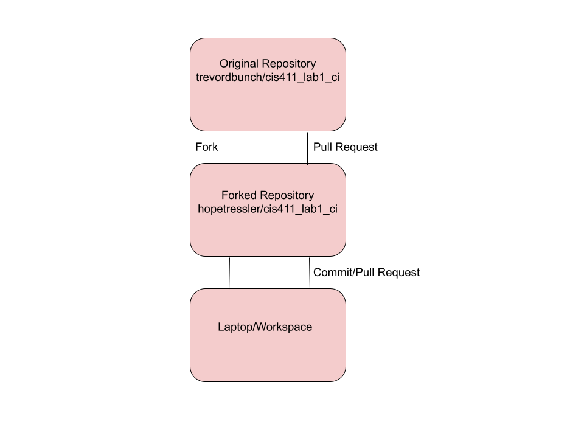
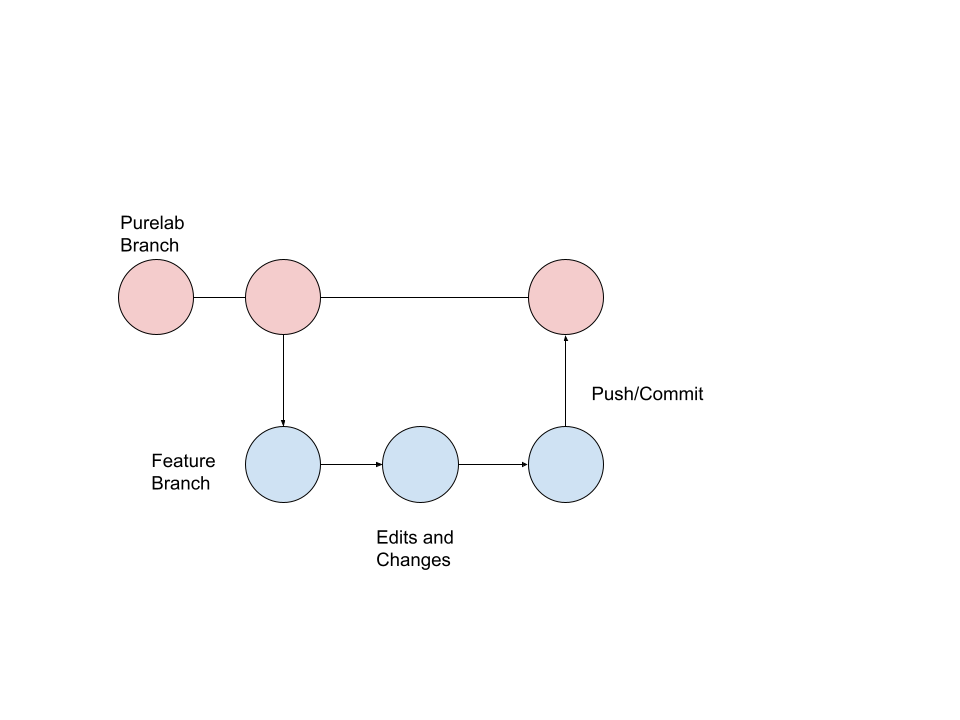

# Lab Report: Continuous Integration
___
**Course:** CIS 411, Spring 2023  
**Instructor(s):** [Hope Tressler](https://github.com/hopetressler)  
**Name:** Hope Tressler  
**GitHub Handle:** hopetressler  
**Repository:** https://github.com/hopetressler/cis411_lab1_CI
___

# Step 1: Fork this repository
- The URL of my forked repository: https://github.com/hopetressler/cis411_lab1_CI
- The accompanying diagram of what my fork precisely and conceptually represents...




# Step 2: Clone your forked repository from the command line  
- My local file directory is C:\Users\mtres\cis411_lab1_CI
- The command to navigate to the directory when I open up the command line is cd C:\Users\mtres\cis411_lab1_CI

# Step 3: Run the application locally
- My GraphQL response from adding myself as an account on the test project
``` json
{
  "data": {
    "mutateAccount": {
      "id": "4ebfdee6-902e-4d6e-8a51-694f591514fe",
      "name": "Hope Tressler",
      "email": "ht1213@messiah.edu"
    }
  }
}
```

# Step 4: Creating a feature branch
- The output of my git commit log
```
34945a7 (HEAD -> labreport, origin/labreport) first commit for CI @trevordbunch
94babae (origin/purelab, origin/HEAD, purelab) Merge pull request #59 from JeffSinsel/purelab
2e92bd8 Fixed typos and links in markdown files
fa4fc85 Update Instructions
f8513e0 Update Node links to Instructions
d4f22eb Update repo branch names
0e3ae4c Reset purelab
050b420 Merge pull request #2 from trevordbunch/main
1fe415c Merge pull request #1 from trevordbunch/labreport
13e571f Update Lab readme, instructions and templates
eafe253 Adjust submitting instructions
47e83cd Add images to LabReport
ec18770 Add Images
dbf826a Answer Step 4
a9c1de6 Complete Step 1, 2 and 3 of LAB_TREVORDBUNCH
1ead543 remove LAB.md
8c38613 Initial commit of labreport with @tangollama
dabceca Merge pull request #24 from tangollama/circleci
a4096db Create README.md
2f01bf4 Update LAB_INSTRUCTIONS.md
347bd50 Update LAB_INSTRUCTIONS.md
7aaa9f3 Update LAB_INSTRUCTIONS.md
37393ae Bug fixed
1949d2a Update LAB_INSTRUCTIONS.md
d36ad90 Update LAB.md
59ef18a Update LAB_INSTRUCTIONS.md
37be3c8 Update LAB_INSTRUCTIONS.md
97da547 Update LAB.md
0bd6244 updated Step 0 title
```
- The accompanying diagram of what my feature branch precisely and conceptually represents...


# Step 5: Setup a Continuous Integration configuration
- What is the .circleci/config.yml doing?  

  It runs tests to ensure that any code in the repository isn't broken due to new pushes. It is a configuration file that provides an on-demand shell to run what is needed. 

- What do the various sections on the config file do?  
   
  Jobs are various tasks to be performed. They are organized in a workflow and an execution environment is specified within a job. Workflows are essentially a group/list of jobs. They are executed when new commits are made and pushed to CircleCI. It will test to see if the workflow is completed successfully by checking if something in the commit prevents said completion. 


- When a CI build is successful, what does that philosophically and practically/precisely indicate about the build?  
   
  Practically/precisely, this indicates that everything in the config.yml file completed successfully; this includes steps, jobs, and workflows. Philosphically, this indicates that the latest commit did not make anything break the project's functionality. 

- If you were to take the next step and ready this project for Continuous Delivery, what additional changes might you make in this configuration (conceptual, not code)?  
   
   I would add deployment jobs that automatically upload the repository to users. I would then also add real tests to the config.yml file to test project functionality.

# Step 6: Merging the feature branch
* The output of my git commit log
```
f088385 (HEAD -> purelab, labreport) Merge remote-tracking branch 'origin/circleci-project-setup' into labreport
d969498 (origin/circleci-project-setup) Add .circleci/config.yml
34945a7 (origin/labreport) first commit for CI @trevordbunch
94babae (origin/purelab, origin/HEAD) Merge pull request #59 from JeffSinsel/purelab
2e92bd8 Fixed typos and links in markdown files
fa4fc85 Update Instructions
f8513e0 Update Node links to Instructions
d4f22eb Update repo branch names
0e3ae4c Reset purelab
050b420 Merge pull request #2 from trevordbunch/main
1fe415c Merge pull request #1 from trevordbunch/labreport
13e571f Update Lab readme, instructions and templates
eafe253 Adjust submitting instructions
47e83cd Add images to LabReport
ec18770 Add Images
dbf826a Answer Step 4
a9c1de6 Complete Step 1, 2 and 3 of LAB_TREVORDBUNCH
1ead543 remove LAB.md
8c38613 Initial commit of labreport with @tangollama
dabceca Merge pull request #24 from tangollama/circleci
a4096db Create README.md
2f01bf4 Update LAB_INSTRUCTIONS.md
347bd50 Update LAB_INSTRUCTIONS.md
7aaa9f3 Update LAB_INSTRUCTIONS.md
37393ae Bug fixed
1949d2a Update LAB_INSTRUCTIONS.md
d36ad90 Update LAB.md
59ef18a Update LAB_INSTRUCTIONS.md
37be3c8 Update LAB_INSTRUCTIONS.md

```

* A screenshot of the _Jobs_ list in CircleCI


# Step 7: Submitting a Pull Request
_Remember to reference at least one other student in the PR content via their GitHub handle._


# Step 8: [EXTRA CREDIT] Augment the core project
PR reference in the report to one of the following:
1. Add one or more unit tests to the core assignment project. 
2. Configure the CircleCI config.yml to automatically build a Docker image of the project.
3. Configure an automatic deployment of the successful CircleCI build to an Amazon EC2 instance.