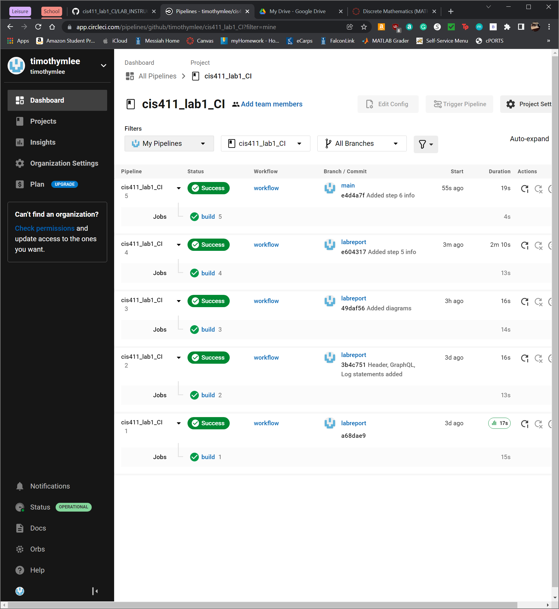

# Lab Report: Continuous Integration
___
**Course:** CIS 411, Spring 2023  
**Instructor(s):** [Trevor Bunch](https://github.com/trevordbunch)  
**Name:** Jonah Robinson  
**GitHub Handle:** [jrmakr2123](https://github.com/jrmakr2123)  
**Repository:** [https://github.com/jrmakr2123/cis411_lab1_CI](https://github.com/jrmakr2123/cis411_lab1_CI)  
___

# Step 1: Fork this repository
- The URL of my forked repository: https://github.com/jrmakr2123/cis411_lab1_CI
- _The accompanying diagram of what my fork precisely and conceptually represents..._
  

# Step 2: Clone your forked repository from the command line  
- My directory is located at . . . 
```
 ~\github repo\cis411_lab1_CI\
```
- The command to navigate to the directory when I open up the command line is . . . 
 
```
cd '~\github repo\cis411_lab1_CI\'
```

# Step 3: Run the application locally
- After running the application locally, it looked like . . . 
``` json
{
  "data": {
    "mutateAccount": {
      "id": "0446a38f-4ea1-41fd-9c44-05c7c32b829b",
      "name": "Jonah Robinson",
      "email": "jr1521@messiah.edu"
    }
  }
}
```

# Step 4: Creating a feature branch
- The output of my git commit log
```
aebcc32 (HEAD -> labreport, origin/purelab, origin/labreport, origin/HEAD, purelab)     modified:   labreports/LAB_jrmakr2123.md
31b3b7f         modified:   labreports/LAB_jrmakr2123.md
bfce461         renamed:    labreports/LAB_Template.md -> labreports/LAB_jrmakr2123.md
c2a2020         modified:   labreports/LAB_Template.md
fa4fc85 (upstream/purelab, upstream/HEAD) Update Instructions
f8513e0 Update Node links to Instructions
d4f22eb Update repo branch names
0e3ae4c Reset purelab
050b420 Merge pull request #2 from trevordbunch/main
1fe415c Merge pull request #1 from trevordbunch/labreport
13e571f Update Lab readme, instructions and templates
eafe253 Adjust submitting instructions
47e83cd Add images to LabReport
ec18770 Add Images
dbf826a Answer Step 4
a9c1de6 Complete Step 1, 2 and 3 of LAB_TREVORDBUNCH
1ead543 remove LAB.md
8c38613 Initial commit of labreport with @tangollama
dabceca Merge pull request #24 from tangollama/circleci
a4096db Create README.md
2f01bf4 Update LAB_INSTRUCTIONS.md
347bd50 Update LAB_INSTRUCTIONS.md
7aaa9f3 Update LAB_INSTRUCTIONS.md
37393ae Bug fixed
1949d2a Update LAB_INSTRUCTIONS.md
d36ad90 Update LAB.md
59ef18a Update LAB_INSTRUCTIONS.md
37be3c8 Update LAB_INSTRUCTIONS.md
```
- _The accompanying diagram of what my feature branch precisely and conceptually represents..._

# Step 5: Setup a Continuous Integration configuration
- What is the .circleci/config.yml doing?  
  - The config.yml file is the environment settings for the test case on Circle CI. By adjusting the parameters of this file, Circle CI is able to generate a docker image to test and run the file format of your choosing. In our case, this is an Node.js file. 


- What do the various sections on the config file do?  
  - The template configuration file is comprised of a couple of parts. There are 3 main sections; a version, orbs, and workflows sections. 
    - The version section determines the version of Circle CI configuration we are using. 
    - The orbs section is a quick way to set up the docker configuration. For example, there are various different types of environments that are the best to run a certain command process. The Node.js orb is specially curated to run npm processes. 
    - The final section is the most difficult section. The workflows section contains the nature of the tests you are going to run. This is where the default test commands are stored to run the Node.js application. If you wish to run a different set of commands you can also add them here. 
   

- When a CI build is successful, what does that philosophically and practically/precisely indicate about the build?  
  - When the CI build is successful, the code that is being tested is correct based on our tests. In reality, our code may not be able to work the way we need it to, however, our code being able to compile and pass our tests proves our code is compatible with our testing criteria and is able to pass it. In the template file format, a successful test run is where our Node.js application is able to run without any errors. By changing the parameters of the config.yml file, we are able to expand on the nature of our tests and what precisely we are testing for. 
   

- If you were to take the next step and ready this project for Continuous Delivery, what additional changes might you make in this configuration (conceptual, not code)?  
  -  I would change the configuration to run every time there is a change to the staging (in this case labreport) branch and the main branch. Doing both branches will help me check to see if there is a discrepancy between both branches and will help me perform checks on if my code will run. I would also implement a log file system. When Circle CI runs, a file in the appropriate branch would be updated to show the actual test and their boolean value. This file would be ignored in push and pull requests thus only staying in its appropriate branch. 
   

# Step 6: Merging the feature branch
* The output of my git commit log
```
[0.25 sec] > git log --oneline
d91f931 (HEAD -> purelab, labreport) @trevorbunch I am merging my labreport and main branch
bf9dca1 (origin/labreport)      deleted:    assets/circleci_setup.png   modified:   assets/circleci_success.png
modified:   labreports/LAB_jrmakr2123.md
2204a05         modified:   labreports/LAB_jrmakr2123.md
3227df4         new file:   .circleci/config.yml        modified:   labreports/LAB_jrmakr2123.md
258b88f         modified:   labreports/LAB_jrmakr2123.md
aebcc32 (origin/purelab, origin/HEAD)   modified:   labreports/LAB_jrmakr2123.md
31b3b7f         modified:   labreports/LAB_jrmakr2123.md
bfce461         renamed:    labreports/LAB_Template.md -> labreports/LAB_jrmakr2123.md
c2a2020         modified:   labreports/LAB_Template.md
fa4fc85 Update Instructions
f8513e0 Update Node links to Instructions
d4f22eb Update repo branch names
0e3ae4c Reset purelab
050b420 Merge pull request #2 from trevordbunch/main
1fe415c Merge pull request #1 from trevordbunch/labreport
13e571f Update Lab readme, instructions and templates
eafe253 Adjust submitting instructions
47e83cd Add images to LabReport
ec18770 Add Images
dbf826a Answer Step 4
a9c1de6 Complete Step 1, 2 and 3 of LAB_TREVORDBUNCH
1ead543 remove LAB.md
8c38613 Initial commit of labreport with @tangollama
dabceca Merge pull request #24 from tangollama/circleci
a4096db Create README.md
2f01bf4 Update LAB_INSTRUCTIONS.md
347bd50 Update LAB_INSTRUCTIONS.md
7aaa9f3 Update LAB_INSTRUCTIONS.md
(END)
```

* This is a screenshot of the _Projects_ list in CircleCI


<!-- # Step 7: Submitting a Pull Request
_Remember to reference at least one other student in the PR content via their GitHub handle._ -->


<!-- 
# Step 8: [EXTRA CREDIT] Augment the core project
PR reference in the report to one of the following:
1. Add one or more unit tests to the core assignment project. 
2. Configure the CircleCI config.yml to automatically build a Docker image of the project.
3. Configure an automatic deployment of the successful CircleCI build to an Amazon EC2 instance. -->
