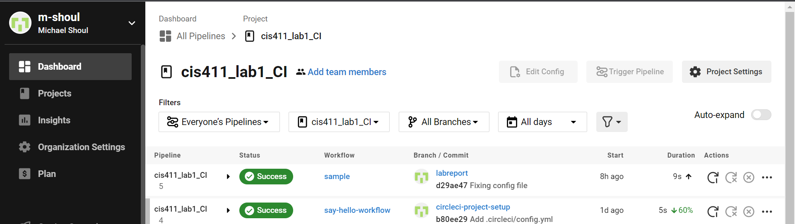
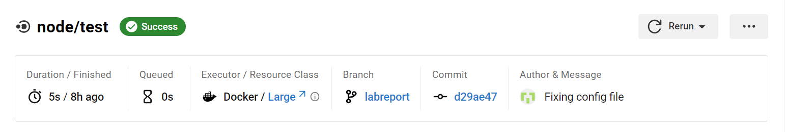
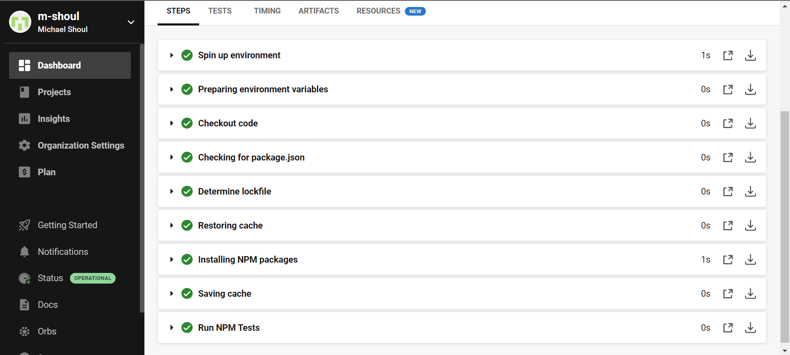

# Lab Report: Continuous Integration
___
**Course:** CIS 411, Spring 2023  
**Instructor(s):** [Trevor Bunch](https://github.com/trevordbunch)  
**Name:** Michael Shoul  
**GitHub Handle:** [m-shoul](https://github.com/m-shoul)  
**Repository:** [m-shoul / cis411_lab1_CI](https://github.com/m-shoul/cis411_lab1_CI) 
___

# Step 1: Fork this repository
- The URL of my forked repository: https://github.com/m-shoul/cis411_lab1_CI
- Diagram representation of [Trevor Bunch's](https://github.com/trevordbunch/cis411_lab1_CI) repository and my newly [forked repository](https://github.com/m-shoul/cis411_lab1_CI):

  

# Step 2: Clone your forked repository from the command line  
- **My local file directory is:** C:\Users\17177\Desktop\Junior\Spring2023\CIS411\GitHub\Lab00\cis411_lab1_CI

- **The command to navigate to the directory when I open up the command line is:** 
```
cd C:\Users\17177\Desktop\Junior\Spring2023\CIS411\GitHub\Lab00\cis411_lab1_CI
```

# Step 3: Run the application locally
- My GraphQL response from adding myself as an account on the test project:
``` json
{
  "data": {
    "mutateAccount": {
      "id": "720f4b18-8630-40c2-972a-b81cc5769335",
      "name": "MICHAEL SHOUL",
      "email": "ms1822@messiah.edu"
    }
  }
}
```

# Step 4: Creating a feature branch
- The output of my git commit log:
```
c4f9703 (HEAD -> labreport, origin/labreport) My first commit on step 4.4, @trevordbunch
fa4fc85 (origin/purelab, origin/HEAD, purelab) Update Instructions
f8513e0 Update Node links to Instructions
d4f22eb Update repo branch names
0e3ae4c Reset purelab
050b420 Merge pull request #2 from trevordbunch/main
1fe415c Merge pull request #1 from trevordbunch/labreport
13e571f Update Lab readme, instructions and templates
eafe253 Adjust submitting instructions
47e83cd Add images to LabReport
ec18770 Add Images
dbf826a Answer Step 4
a9c1de6 Complete Step 1, 2 and 3 of LAB_TREVORDBUNCH
1ead543 remove LAB.md
8c38613 Initial commit of labreport with @tangollama
dabceca Merge pull request #24 from tangollama/circleci
a4096db Create README.md
2f01bf4 Update LAB_INSTRUCTIONS.md
347bd50 Update LAB_INSTRUCTIONS.md
7aaa9f3 Update LAB_INSTRUCTIONS.md
37393ae Bug fixed
1949d2a Update LAB_INSTRUCTIONS.md
d36ad90 Update LAB.md
59ef18a Update LAB_INSTRUCTIONS.md
37be3c8 Update LAB_INSTRUCTIONS.md
97da547 Update LAB.md
0bd6244 updated Step 0 title
4562cd8 added npm and node install repreq
255051e adding template
```
- The accompanying diagram of what my feature branch precisely and conceptually represents:


# Step 5: Setup a Continuous Integration configuration
- **What is the .circleci/config.yml doing?**
  - The  ```.circleci/config.yml``` defines how CircleCI builds, tests, and deploys the application. This file specifies the version, jobs, steps, and workflow that make up the CI/CD pipeline. It includes what commands to run, what environment to run them in, and the order in which the commands are to be executed.

- **What do the various sections on the config file do?**
  
1. **version:**  Defines the latest version of the CircleCI pipeline process engine. The version field is intended to be used to issue warnings for depreciation or breaking changes.
   
2. **orbs:** Reusable packages of CircleCI configuration that you may share across projects, enabling you to create encapsulated, parameterized commands, jobs, and executors that can be used across multiple projects.
   
3. **node:** The node in the `orbs` section refers to the version of Node.js language runtime environment. This ensures the code is running consistently across different environments and reduces the risk of compatibility issues.
   
4. **workflows:** Used to define a collection of jobs and run them in order. Workflows can be used to run and troubleshoot jobs independently.
   
5. **sample:** `sample` represents the name of the workflow in the config file, and this can be altered to better match the workflow.

6. **jobs:** Jobs are named sets of steps that are run in a specific environment and executed in parallel.
   
7. **node/test:** This part refers to a step that runs tests on a Node.js application to validate the functionality and quality of the code before it is deployed.
   
8. **version:** ```version``` inside the workflow section represents the node version to use for the `cimg-node` tag. `cimg-node` is a Docker image created by CircleCI with continuous integration builds in mind.
 
9.  **pkg-manager:** This is a tool used to manage the dependencies of a project. This is making sure that I have `npm` installed and available before the test runs.

- **When a CI build is successful, what does that philosophically and practically/precisely indicate about the build?**  
  - Philosophically this indicates that the practices used by the team to integrate code into an application are effective and functional.
  - Practically this indicates the build has been run successfully without any errors and that the application has been built successfully.
  - Precisely this indicates that all tests have passed and that the integration and build of the application was a success.

- **If you were to take the next step and ready this project for Continuous Delivery, what additional changes might you make in this configuration (conceptual, not code)?**  
  - If I were to ready this project for continuous delivery, I would add some type of documentation notes into the configuration to provide written information of what was changed each delivery cycle. I would also add some type of process to check the quality of the code before it is deployed to prevent committing bugs into the live environment.

# Step 6: Merging the feature branch
* The output of my git commit log:

```
be04011 (HEAD -> main) Merge branch 'labreport'
714ba96 (labreport) Commit on Step 6.1
1b3009d Commit on Step 6
d29ae47 (origin/labreport) Fixing config file
d5266da Merge circleci-branch
97eec35 Merge remote-tracking branch 'origin/circleci-project-setup' into labreport
0486862 (origin/circleci-project-setup) Add .circleci/config.yml
9140663 Added .circleci folder
038e8bd Added feature branch imag into GitHub
0d037d3 End of part 4
c4f9703 My first commit on step 4.4, @trevordbunch
fa4fc85 (origin/purelab, origin/HEAD, purelab) Update Instructions
f8513e0 Update Node links to Instructions
7490dcb (upstream/main) Add Links to Node in Instructions
ecaaa53 Update branch terminology
d4f22eb Update repo branch names
c552213 Merge pull request #3 from hallienicholas/main
78ede9f Corrected error
0e3ae4c Reset purelab
050b420 Merge pull request #2 from trevordbunch/main
1fe415c Merge pull request #1 from trevordbunch/labreport
13e571f Update Lab readme, instructions and templates
eafe253 Adjust submitting instructions
47e83cd Add images to LabReport
ec18770 Add Images
dbf826a Answer Step 4
a9c1de6 Complete Step 1, 2 and 3 of LAB_TREVORDBUNCH
1ead543 remove LAB.md
8c38613 Initial commit of labreport with @tangollama
:
```

* A screenshot of the _Jobs_ list in CircleCI:



