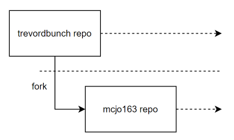
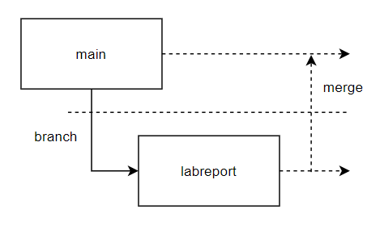

# Lab Report: Continuous Integration

___
**Course:** CIS 411, Spring 2021  
**Instructor(s):** [Trevor Bunch](https://github.com/trevordbunch)  
**Name:** Micah Johnson  
**GitHub Handle:** mcjo163  
**Repository:** [mcjo163/cis411_lab1_CI](https://github.com/mcjo163/cis411_lab1_CI)
___

## Step 1: Fork this repository

- The URL of my forked repository: [mcjo163/cis411_lab1_CI](https://github.com/mcjo163/cis411_lab1_CI)
- The accompanying diagram of what my fork precisely and conceptually represents...



## Step 2: Clone your forked repository from the command line  

- My local file directory is `C:\Users\Micah Johnson\Documents\School\2020-21\Spring\Sys Analysis & Design Concepts\labs\cis411_lab1_CI`
- The command to navigate to the directory when I open up the command line is `cd C:\Users\Micah Johnson\Documents\School\2020-21\Spring\Sys Analysis & Design Concepts\labs\cis411_lab1_CI`

## Step 3: Run the application locally

- My GraphQL response from adding myself as an account on the test project

```json
{
  "data": {
    "mutateAccount": {
      "id": "498ba01b-6057-451f-83dc-5fccd2dcfb39",
      "name": "Micah Johnson",
      "email": "mj1262@messiah.edu"
    }
  }
}
```

## Step 4: Creating a feature branch

- The output of my git commit log (oldest entries were cut off)

```code
8f4954a (HEAD -> labreport, origin/labreport) started lab report @trevordbunch
e0af513 (origin/main, origin/HEAD, main) readme quickfix
7490dcb Add Links to Node in Instructions
ecaaa53 Update branch terminology
c552213 Merge pull request #3 from hallienicholas/main
78ede9f Corrected error
1fe415c Merge pull request #1 from trevordbunch/labreport
13e571f Update Lab readme, instructions and templates
eafe253 Adjust submitting instructions
47e83cd Add images to LabReport
ec18770 Add Images
dbf826a Answer Step 4
a9c1de6 Complete Step 1, 2 and 3 of LAB_TREVORDBUNCH
1ead543 remove LAB.md
8c38613 Initial commit of labreport with @tangollama
```

- The accompanying diagram of what my feature branch precisely and conceptually represents



## Step 5: Setup a Continuous Integration configuration

- **What is the .circleci/config.yml doing?**
  - The file describes the actions taken when new code is pushed to the remote repo. From what I can tell, there is a built-in test process for node apps and it is running that to make sure that the server is working as expected.
- **What do the various sections on the config file do?**  
  - Based on the intro given when I signed up for CircleCI, it looks like the `orbs` section imports jobs from other locations. In this case it seems to be creating an orb called 'node' that is a reference to some circleci built-in process called 'node@3.0.0'.
  - The `workflows` section outlines the steps taken when building. In this case, a workflow called 'node-tests' is defined which only contains a single job - the test job found within the imported 'node' orb.
  - I would not be surprised if my terminology above is incorrect, but I think I have the basic relationships between the sections down correctly.
- **When a CI build is successful, what does that philosophically and practically/precisely indicate about the build?**  
  - It means the build passed the outlined steps. Ideally, this would mean that there is nothing wrong with the new code, and that it will merge flawlessly into the existing code base. Practically, though, it is possible that there were things missed by the integration tests that could cause unforseen issues.
- **If you were to take the next step and ready this project for Continuous Delivery, what additional changes might you make in this configuration (conceptual, not code)?**  
  - If the code passes the integration tests, then ideally it is ready for delivery as well (if it is inteded to be delivered code), so the configuration should include modifying the production code to include the new changes as well. Scheduling should be considered so that the production server would not have to be shut down during a high-traffic time.

## Step 6: Merging the feature branch

- The output of my git commit log (older entries were cut off)

```code
1002a6c (HEAD -> main, labreport) lab report mostly complete
2b0464c (origin/labreport) added config yaml
8f4954a started lab report @trevordbunch
e0af513 (origin/main, origin/HEAD) readme quickfix
7490dcb Add Links to Node in Instructions
ecaaa53 Update branch terminology
c552213 Merge pull request #3 from hallienicholas/main
78ede9f Corrected error
1fe415c Merge pull request #1 from trevordbunch/labreport
13e571f Update Lab readme, instructions and templates
eafe253 Adjust submitting instructions
47e83cd Add images to LabReport
ec18770 Add Images
dbf826a Answer Step 4
a9c1de6 Complete Step 1, 2 and 3 of LAB_TREVORDBUNCH
```

- A screenshot of the _Jobs_ list in CircleCI


## Step 7: Submitting a Pull Request

Referenced Josiah McCracken (@scribhneoir).
