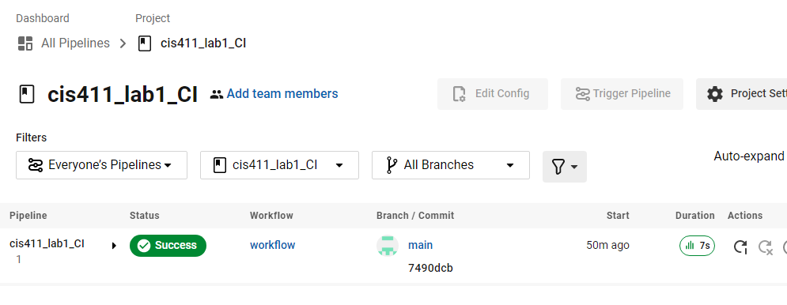

# Lab Report: Continuous Integration
___
**Course:** CIS 411, Spring 2022  
**Instructor(s):** [Trevor Bunch](https://github.com/trevordbunch)  
**Name:** Tyler Regitz  
**GitHub Handle:** [ztigerR](https://github.com/ztigerR)  
**Repository:** [Repo](https://github.com/ztigerR/cis411_lab1_CI)  
___

# Step 1: Fork this repository
- The URL of my forked repository: [Repo](https://github.com/ztigerR/cis411_lab1_CI) 
- The accompanying diagram of what my fork precisely and conceptually represents...
  
  

# Step 2: Clone your forked repository from the command line  
- My local file directory is...
  
  cis411_lab1_CI
- The command to navigate to the directory when I open up the command line is...
  
  cd C:\Users\regit\CIS%20411\cis411_lab1_CI

# Step 3: Run the application locally
- My GraphQL response from adding myself as an account on the test project
``` json
{
  "data": {
    "mutateAccount": {
      "id": "f4f90058-ec53-48cf-90a8-fcf23f8778c8",
      "name": "Tyler Regitz",
      "email": "tr1245@messiah.edu"
    }
  }
}
```

# Step 4: Creating a feature branch
- The output of my git commit log
```
1bcbe57 (HEAD -> labreport, origin/labreport) first commit @trevorbunch
7490dcb (origin/main, origin/HEAD, main) Add Links to Node in Instructions
ecaaa53 Update branch terminology
c552213 Merge pull request #3 from hallienicholas/main
78ede9f Corrected error
1fe415c Merge pull request #1 from trevordbunch/labreport
13e571f Update Lab readme, instructions and templates
eafe253 Adjust submitting instructions
47e83cd Add images to LabReport
ec18770 Add Images
dbf826a Answer Step 4
a9c1de6 Complete Step 1, 2 and 3 of LAB_TREVORDBUNCH
```
- The accompanying diagram of what my feature branch precisely and conceptually represents...
  
  

# Step 5: Setup a Continuous Integration configuration
- What is the .circleci/config.yml doing? 
   
  This config file loads the repository into a docker image that will build and run the repositiory to test for any errors delcared in the config file itself. This allows for fast small builds of code to be tested while still keeping the coding quality up.

- What do the various sections on the config file do? 
   
   There are two main sections of code in this config file. The first being the docker section. This section defines the enviorment with the build will be tested. </br>

   The second section that is important is the steps sections. This section contains the commands that will be preformed on the code in the docker image enviorment. This section sets up the tests and runs the tests on the code.

- When a CI build is successful, what does that philosophically and practically/precisely indicate about the build?  
  
   The code is ready for integration into the full build of the project.

- If you were to take the next step and ready this project for Continuous Delivery, what additional changes might you make in this configuration (conceptual, not code)?  
  
  There would need to be another step in the steps section of the cofig file that is related to commands for deployment to the platform you want to send the build to. 
   

# Step 6: Merging the feature branch
* The output of my git commit log
```
77f9897 (HEAD -> main, labreport) second commit
1bcbe57 (origin/labreport) first commit @trevorbunch
7490dcb (origin/main, origin/HEAD) Add Links to Node in Instructions 
ecaaa53 Update branch terminology
c552213 Merge pull request #3 from hallienicholas/main
78ede9f Corrected error
1fe415c Merge pull request #1 from trevordbunch/labreport
13e571f Update Lab readme, instructions and templates
eafe253 Adjust submitting instructions
47e83cd Add images to LabReport
ec18770 Add Images
dbf826a Answer Step 4
```

* A screenshot of the _Jobs_ list in CircleCI


# Step 7: Submitting a Pull Request
_Remember to reference at least one other student in the PR content via their GitHub handle._


# Step 8: [EXTRA CREDIT] Augment the core project
PR reference in the report to one of the following:
1. Add one or more unit tests to the core assignment project. 
2. Configure the CircleCI config.yml to automatically build a Docker image of the project.
3. Configure an automatic deployment of the successful CircleCI build to an Amazon EC2 instance.
